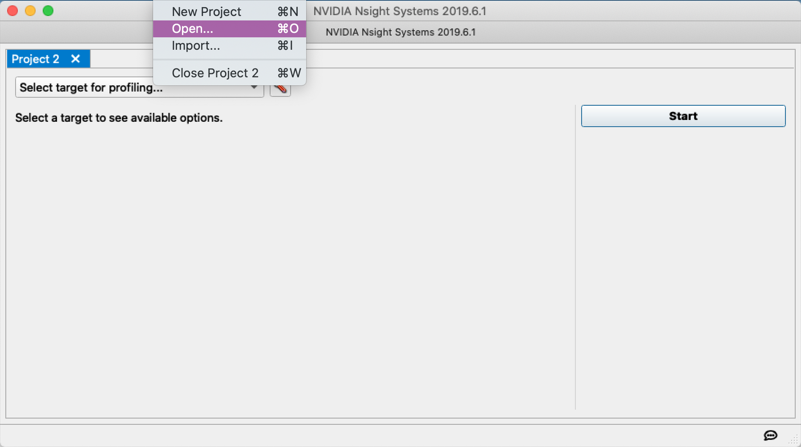
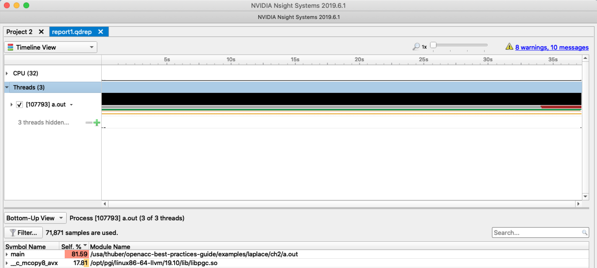

アプリケーションパフォーマンスの評価
==============================
アプリケーションのパフォーマンスを評価するために様々なツールを使用でき、利用可能なツールは開発環境によって異なります。シンプルなアプリケーションタイマーからグラフィカルなパフォーマンスアナライザーまで、パフォーマンス分析ツールの選択はこのドキュメントの範囲外です。このセクションの目的は、高速化のための重要なコードセクションを選択するためのガイダンスを提供することであり、これは利用可能なプロファイリングツールに依存しません。

このガイド全体を通じて、CUDAツールキットに付属するNVIDIA Nsight Systemsパフォーマンス分析ツールをCPUプロファイリングに使用します。アクセラレータプロファイリングが必要な場合、アプリケーションをNVIDIA GPU上で実行し、NVIDIA Nsight Systemsプロファイラーを再度使用します。

ベースラインプロファイリング
------------------
OpenACCでアプリケーションを並列化する前に、プログラマーはまず現在コードのどこで時間が費やされているかを理解する必要があります。実行時間の大部分を占めるルーチンとループは、*ホットスポット*と呼ばれることが多く、アプリケーションを高速化するための出発点になります。アプリケーションプロファイルを生成するためのさまざまなツールが存在します。例えば、gprof、Vampir、Nsight Systems、TAUなどです。特定のアプリケーションに最適な特定のツールを選択することはこのドキュメントの範囲外ですが、どのツールまたはツールを使用するかに関係なく、以下はアプリケーションの並列化における次のステップをガイドするのに役立つ重要な情報です。

* アプリケーションパフォーマンス - アプリケーションの実行にどのくらいの時間がかかりますか？プログラムはコンピューティングリソースをどの程度効率的に使用していますか？
* プログラムのホットスポット - プログラムはどのルーチンで最も多くの時間を費やしていますか？これらの重要なルーチン内で何が行われていますか？アプリケーションの最も時間のかかる部分に焦点を当てることで、最大の結果が得られます。
* パフォーマンスの制限要因 - 特定されたホットスポット内で、現在アプリケーションのパフォーマンスを制限しているものは何ですか？一般的な制限要因には、I/O、メモリ帯域幅、キャッシュ再利用、浮動小数点パフォーマンス、通信などがあります。特定のループネストのパフォーマンス制限要因を評価する1つの方法は、その*計算強度*を評価することです。これは、メモリからのロードまたはストアごとにデータ要素に対して実行される演算の数の尺度です。
* 利用可能な並列性 - ホットスポット内のループを調べて、各ループネストがどれだけの作業を実行するかを理解します。ループは10回、100回、1000回（またはそれ以上）反復しますか？ループの反復は互いに独立して動作しますか？個々のループだけでなく、ネスト全体の全体像を理解するためにループのネストを見てください。

上記のようなベースラインデータを収集することは、最良の結果を得るために開発者が努力を集中する場所を知らせるのに役立ち、プロセスの残りの部分でパフォーマンスを比較するための基礎を提供します。アプリケーションが高速化された後にどのように使用されるかを現実的に反映する入力を選択することが重要です。プロファイリングに既知のベンチマーク問題を使用したくなりますが、多くの場合、これらのベンチマーク問題は縮小された問題サイズまたは縮小されたI/Oを使用しており、プログラムパフォーマンスに関する誤った仮定につながる可能性があります。多くの開発者は、ベースラインプロファイルを使用して、アプリケーションの高速化時に正確性を検証するために使用するアプリケーションの期待される出力を収集します。

追加のプロファイリング
--------------------
OpenACCでアプリケーションを移植および最適化するプロセスを通じて、プロセスの次のステップをガイドするために追加のプロファイルデータを収集する必要があります。Nsight SystemsやVampirなどの一部のプロファイリングツールは、CPUとGPUの両方でのプロファイリングをサポートしていますが、gprofなどの他のツールは、特定のプラットフォームでのプロファイリングのみをサポートしている場合があります。さらに、一部のコンパイラは、アプリケーションに独自のプロファイリングを組み込んでいます。例えば、NVHPCコンパイラの場合、アプリケーションに関するランタイム情報を収集するためにNVCOMPILER\_ACC\_TIME環境変数を設定することをサポートしています。CPU + GPUプラットフォームなどのオフロードプラットフォームで開発する場合、計算に費やされた時間とPCIeデータ転送に費やされた時間の両方を評価できるプロファイリングツールを開発プロセス全体で使用することが一般的に重要です。このドキュメントでは、この分析を実行するためにNVIDIA Nsight Systemsプロファイラーを使用しますが、これはNVIDIAプラットフォームでのみ利用可能です。

ケーススタディ - 分析
---------------------
ケーススタディプログラムをよりよく理解するために、CUDAツールキットおよびNVIDIA HPC SDKの一部として付属するNVIDIA NSight Systemsコマンドラインインターフェースを使用します。まず、実行可能ファイルをビルドする必要があります。コンパイラがプログラムをどのように最適化したかに関する追加情報が表示されるように、以下の例に含まれるフラグを使用することを忘れないでください。実行可能ファイルは次のコマンドでビルドされます：

~~~~
    $ nvc -fast -Minfo=all laplace2d.c
    GetTimer:
         21, include "timer.h"
              61, FMA (fused multiply-add) instruction(s) generated
    main:
         41, Loop not fused: function call before adjacent loop
             Loop unrolled 8 times
         49, StartTimer inlined, size=2 (inline) file laplace2d.c (37)
         52, FMA (fused multiply-add) instruction(s) generated
         58, Generated vector simd code for the loop containing reductions
         68, Memory copy idiom, loop replaced by call to __c_mcopy8
         79, GetTimer inlined, size=10 (inline) file laplace2d.c (54)
~~~~

実行可能ファイルがビルドされたら、`nsys`コマンドが実行可能ファイルを実行し、NVIDIA Nsight Systems GUIでオフラインで表示できるプロファイリングレポートを生成します。

~~~~
    $ nsys profile ./a.out
    
    Jacobi relaxation Calculation: 4096 x 4096 mesh
        0, 0.250000
      100, 0.002397
      200, 0.001204
      300, 0.000804
      400, 0.000603
      500, 0.000483
      600, 0.000403
      700, 0.000345
      800, 0.000302
      900, 0.000269
     total: 36.480533 s
     Processing events...
Capturing symbol files...
Saving temporary "/tmp/nsys-report-2f5b-f32e-7dec-9af0.qdstrm" file to disk...
Creating final output files...

Processing [==============================================================100%]
Saved report file to "/tmp/nsys-report-2f5b-f32e-7dec-9af0.qdrep"
Report file moved to "/home/ubuntu/openacc-programming-guide/examples/laplace/ch2/report1.qdrep"
~~~~

データが収集され、.qdrepレポートが生成されたら、Nsight Systems GUIを使用して視覚化できます。まず、レポート（上記の例のreport1.qdrep）をグラフィカル機能を持つマシンにコピーし、Nsight Systemsインターフェースをダウンロードする必要があります。次に、アプリケーションを開き、ファイルマネージャーを介してファイルを選択する必要があります。

Nsight Systemsでレポートを開くと、時間の大部分が2つのルーチン、mainと\_\_c\_mcopy8で費やされていることがわかります。Nsight systemsの初期画面のスクリーンショットを図2.1に示します。このケーススタディのコードはプログラムのmain関数内に完全にあるため、ほぼすべての時間がmainで費やされることは驚くことではありませんが、より大きなアプリケーションでは、時間は他のいくつかのルーチンで費やされる可能性があります。

main関数をクリックすると、main内のランタイムのほぼすべてが、Aの次の値を計算するループから来ていることがわかります。これを図2.2に示します。しかし、プロファイラー出力から明らかではないのは、初期画面に表示されるメモリコピールーチンで費やされた時間が、実際には各反復の最後に配列スワップを実行する2番目のループネストであることです。上記のコンパイラ出力は、68行目のループがメモリコピーに置き換えられたことを示しています。これは、各要素を個別にコピーするよりも効率的だからです。したがって、プロファイラーが実際に示しているのは、アプリケーションの主要なホットスポットは、`A`から`Anew`を計算するループネストと、次の反復のために`Anew`から`A`にコピーするループネストであるということです。したがって、これら2つのループネストに努力を集中します。

次の章では、この章で例アプリケーション内のホットスポットとして特定されたループを最適化します。
