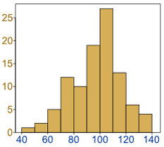
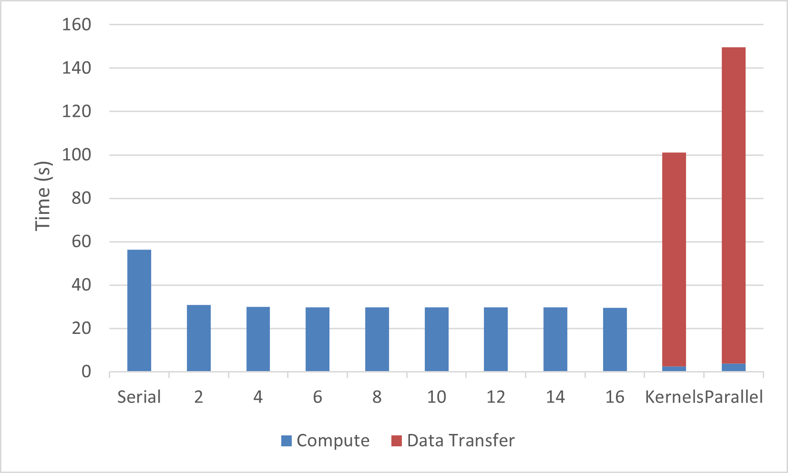
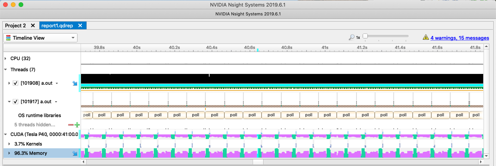

ループの並列化
=================
アプリケーション内の重要なホットスポットが特定されたら、プログラマーはこれらのホットスポットに対してOpenACCディレクティブを追加し、重要なループを段階的に高速化する必要があります。このプロセスの段階では、データの移動について考える必要はありません。OpenACCコンパイラが特定された領域で必要なデータを分析し、アクセラレータ上でデータが利用可能であることを自動的に保証します。このステップで並列性のみに焦点を当てることで、プログラマーはできるだけ多くの計算をデバイスに移動でき、次のステップでデータ移動を最適化する前に、プログラムが正しい結果を出していることを確認できます。
このプロセスのステップでは、個々のループの実行がアクセラレータを使用してより高速になっても、アプリケーション全体の実行時間が増加することがよくあります。これは、コンパイラがデータ移動に対して慎重なアプローチを取る必要があり、実際に必要な量よりも多くのデータをアクセラレータとの間で頻繁にコピーするためです。このステップで全体の実行時間が増加しても、開発者は次のステップに進んでディレクティブから利益を得る前に、コード内でかなりの量の並列性を表現することに集中する必要があります。

----

OpenACCは、コード内の並列性を公開するための2つの異なるアプローチを提供します：
`parallel`と`kernels`領域です。これらのディレクティブについては、続くセクションで詳しく説明します。

Kernels構文
---------------------
`kernels`構文は、並列性を含む可能性のあるコード領域を識別しますが、その領域の分析、どのループを並列化しても安全かを識別し、それらのループを高速化することについては、コンパイラの自動並列化機能に依存します。並列プログラミングの経験がほとんどないか全くない開発者、または並列化される可能性のある多くのループネストを含む関数を扱っている開発者にとって、kernelsディレクティブはOpenACC高速化の良い出発点となります。以下のコードは、C/C++とFortranの両方での`kernels`の使用方法を示しています。

~~~~ {.c .numberLines}
    #pragma acc kernels
    {
      for (i=0; i<N; i++)
      {
        y[i] = 0.0f;
        x[i] = (float)(i+1);
      }
    
      for (i=0; i<N; i++)
      {
        y[i] = 2.0f * x[i] + y[i];
      }
    }
~~~~    

----

~~~~ {.fortran .numberLines}
    !$acc kernels
    do i=1,N
      y(i) = 0
      x(i) = i
    enddo
  
    do i=1,N
      y(i) = 2.0 * x(i) + y(i)
    enddo
    !$acc end kernels
~~~~    

この例では、コードは2つの配列を初期化し、それらに対して単純な計算を実行しています。Cでは波括弧を使用し、Fortranでは開始と終了のディレクティブを使用して、高速化の候補となる2つのループを含むコードブロックを識別していることに注目してください。コンパイラはこれらのループのデータ独立性を分析し、それぞれに対してアクセラレータ*カーネル*を生成することで両方のループを並列化します。コンパイラには、これらのループで利用可能な並列性をハードウェアにマッピングする最良の方法を決定する完全な自由が与えられており、これは構築対象のアクセラレータに関係なく同じコードを使用できることを意味します。コンパイラは、ターゲットアクセラレータに関する独自の知識を使用して、高速化のための最良のパスを選択します。ただし、`kernels`ディレクティブについての1つの注意点は、コンパイラがループがデータ独立であることを確信できない場合、そのループを並列化しないことです。コンパイラがループを非並列と誤って識別する一般的な理由については、後のセクションで説明します。

Parallel構文
----------------------
`parallel`構文は、OpenACC *ギャング*全体で並列化されるコード領域を識別します。`parallel`領域単独では用途が限られますが、`loop`ディレクティブ（後で詳しく説明）と組み合わせると、コンパイラはアクセラレータ用のループの並列バージョンを生成します。
これら2つのディレクティブは、単一の`parallel loop`ディレクティブに結合することができ、最も頻繁に結合されます。このディレクティブをループに配置することで、プログラマーは影響を受けるループが並列化しても安全であることを表明し、コンパイラがターゲットアクセラレータ上でループの反復をどのようにスケジュールするかを選択できるようにします。以下のコードは、C/C++とFortranの両方での`parallel loop`結合ディレクティブの使用方法を示しています。

~~~~ {.c .numberLines}
    #pragma acc parallel loop
      for (i=0; i<N; i++)
      {
        y[i] = 0.0f;
        x[i] = (float)(i+1);
      }
    
    #pragma acc parallel loop
      for (i=0; i<N; i++)
      {
        y[i] = 2.0f * x[i] + y[i];
      }
~~~~

----

~~~~ {.fortran .numberLines}
    !$acc parallel loop
    do i=1,N
      y(i) = 0
      x(i) = i
    enddo
  
    !$acc parallel loop
    do i=1,N
      y(i) = 2.0 * x(i) + y(i)
    enddo
~~~~    

`kernels`ディレクティブとは異なり、各ループに`parallel loop`ディレクティブを明示的に配置する必要があることに注意してください。これは、`parallel`構文がループの独自のコンパイラ分析を実行するのではなく、プログラマーがコード内の並列性を識別することに依存しているためです。この場合、プログラマーは並列性の可用性を識別するだけで、その並列性をアクセラレータにマッピングする方法の決定は、デバイスに関するコンパイラの知識に委ねています。これは、OpenACCを他の類似のプログラミングモデルと差別化する重要な機能です。プログラマーは、並列性を活用する方法をコンパイラに指示することなく、並列性を識別します。これは、コードの並列化方法の詳細がソースにハードコードされるのではなく、コンパイラの知識に委ねられるため、OpenACCコードが開発されているデバイス以外のデバイスにも移植可能であることを意味します。

ParallelとKernelsの違い
----------------------------------------
新しいOpenACCプログラマーにとって最大の混乱の1つは、同じことを行うように見える`parallel`と`kernels`の両方のディレクティブが仕様に存在する理由です。これらは非常に密接に関連していますが、微妙な違いがあります。`kernels`構文は、ターゲットアクセラレータに最適な方法でコードを並列化および最適化するための最大の余地をコンパイラに与えますが、コンパイラがコードを自動的に並列化する能力に最も大きく依存します。その結果、プログラマーは、異なるコンパイラが並列化できるものとその方法に違いがあることに気づくかもしれません。`parallel loop`ディレクティブは、影響を受けるループを並列化することが安全で望ましいというプログラマーによる表明です。これは、プログラマーがコード内の並列性を正しく識別し、並列化するのが安全でないものをコードから削除することに依存します。プログラマーがループを並列化できると誤って表明すると、結果のアプリケーションは不正確な結果を生成する可能性があります。

別の言い方をすれば：`kernels`構文は、コンパイラに並列性を探す場所のヒントと考えることができ、`parallel`ディレクティブは、並列性がある場所のコンパイラへの表明です。

`kernels`構文について注意すべき重要な点は、コンパイラがコードを分析し、並列化しても安全であると確信した場合にのみ並列化することです。場合によっては、コンパイラがコンパイル時にループを並列化しても安全かどうかを判断するのに十分な情報を持っていないことがあり、その場合、プログラマーがループが安全に並列であることを明確に見ることができても、コンパイラはループを並列化しません。たとえば、配列がポインターとして表されるC/C++コードの場合、コンパイラは2つの配列が同じメモリを参照していない、つまり*ポインターエイリアシング*として知られることを常に判断できるとは限りません。コンパイラが2つのポインターがエイリアシングされていないことを知ることができない場合、それらの配列にアクセスするループを並列化できません。

***ベストプラクティス：*** Cプログラマーは、コンパイラにポインターがエイリアシングされていないことを通知するために、可能な限り`restrict`キーワード（またはC++の`__restrict`デコレーター）を使用する必要があります。これにより、コンパイラはそうでなければ並列化しなかったループを並列化するのに十分な情報を頻繁に得ることができます。`restrict`キーワードに加えて、`const`キーワードを使用して定数変数を宣言することで、アクセラレータにそのようなメモリが存在する場合、コンパイラがその変数に読み取り専用メモリを使用できるようになる可能性があります。`const`と`restrict`の使用は一般的に良いプログラミングプラクティスです。コードを最適化する際に使用できる追加情報をコンパイラに提供するためです。

Fortranプログラマーも、OpenACCコンパイラが`kernels`構文に含まれるFortran配列構文を並列化することに注意する必要があります。代わりに`parallel`を使用する場合、配列の要素に対するループを明示的に導入する必要があります。

`kernels`構文が提供するもう1つの注目すべき利点は、領域内のループで使用するためにデータがデバイスに移動された場合、そのデータは領域の全範囲にわたって、またはその領域内でホストで再び必要になるまでデバイスに残ることです。これは、複数のループが同じデータにアクセスする場合、アクセラレータに1回だけコピーされることを意味します。同じデータにアクセスする2つの連続したループで`parallel loop`を使用する場合、コンパイラは2つのループの間でホストとデバイスの間でデータをコピーする場合としない場合があります。前のセクションで示した例では、コンパイラは両方のparallelループに対して暗黙的なデータ移動を生成しますが、`kernels`アプローチに対してはデータ移動を1回だけ生成するため、デフォルトでデータ移動が少なくなる可能性があります。この違いは、この章の後半のケーススタディで再検討されます。

`kernels`と`parallel`ディレクティブの違いの詳細については、[http://www.pgroup.com/lit/articles/insider/v4n2a1.htm]を参照してください。

---

この時点で、多くのプログラマーは、コードでどちらのディレクティブを使用すべきか疑問に思うでしょう。コード内の並列ループをすでに識別している、より経験豊富な並列プログラマーは、おそらく`parallel loop`アプローチがより望ましいと感じるでしょう。並列プログラミングの経験が少ないプログラマーや、分析する必要のある多数のループを含むコードを持つプログラマーは、コンパイラにより多くの負担をかけるため、`kernels`アプローチがはるかに簡単であることに気づくでしょう。両方のアプローチには利点があるため、新しいOpenACCプログラマーは、どちらのアプローチが自分に適しているかを自分で判断する必要があります。プログラマーは、意味がある場合、コードの一部で`kernels`を使用し、別の部分で`parallel`を使用することもできます。

**注意：** このドキュメントの残りの部分では、*並列領域*というフレーズは`parallel`または`kernels`領域のいずれかを説明するために使用されます。`parallel`構文を参照する場合、この文に示すようにターミナルフォントが使用されます。

Loop構文
------------------
`loop`構文は、ソースコード内の次のループに関する追加情報をコンパイラに提供します。`loop`ディレクティブは、`parallel`ディレクティブとの接続で上記に示されましたが、`kernels`でも有効です。Loop句には2つの形式があります：正確性のための句と最適化のための句です。この章では、2つの正確性句のみを説明し、後の章で最適化句について説明します。

### private ###
private句は、各ループ反復にリストされた変数の独自のコピーが必要であることを指定します。たとえば、各ループに計算中に使用する`tmp`という名前の小さな一時配列が含まれている場合、正しい結果を保証するために、この変数を各ループ反復にプライベートにする必要があります。`tmp`がプライベートとして宣言されていない場合、異なるループ反復を実行するスレッドがこの共有`tmp`変数に予測不可能な方法でアクセスする可能性があり、競合状態と潜在的に不正確な結果につながります。以下は`private`句の構文です。

    private(var1, var2, var3, ...)

ループ内のスカラー変数について理解しなければならないいくつかの特殊なケースがあります。まず、ループイテレーターはデフォルトでプライベート化されるため、プライベートとしてリストする必要はありません。次に、特に指定されない限り、並列ループ内でアクセスされるスカラーは、デフォルトで*ファーストプライベート*になります。つまり、各ループ反復に対して変数のプライベートコピーが作成され、領域に入る際にそのスカラーの値で初期化されます。最後に、CまたはC++のループ内で宣言された変数（スカラーかどうかに関係なく）は、デフォルトでそのループの反復にプライベートになります。

注意：`parallel`構文にも`private`句があり、これは並列領域内の各ギャングに対してリストされた変数をプライベート化します。

### reduction ###
`reduction`句は、影響を受ける変数のプライベートコピーが各ループ反復に対して生成されるという点で`private`句と同様に機能しますが、`reduction`はさらに一歩進んで、これらすべてのプライベートコピーを1つの最終結果に削減し、それを領域から返します。たとえば、変数のすべてのプライベートコピーの最大値が必要な場合があります。削減は、スカラー変数に対してのみ指定でき、`+`、`*`、`min`、`max`、およびさまざまなビット演算など、指定された一般的な操作のみを実行できます（完全なリストについてはOpenACC仕様を参照してください）。reduction句の形式は次のとおりです。*operator*は対象の操作に、*variable*は削減される変数に置き換えてください。

    reduction(operator:variable)

`reduction`句の使用例は、以下のケーススタディで示します。

Routineディレクティブ
-----------------
並列ループ内の関数またはサブルーチン呼び出しは、コンパイラにとって問題になる可能性があります。コンパイラがすべてのループを一度に見ることが常に可能であるとは限らないためです。OpenACC 1.0コンパイラは、並列領域内で呼び出されるすべてのルーチンをインライン化するか、ルーチン呼び出しを含むループをまったく並列化しないかのいずれかを強制されました。OpenACC 2.0は、この欠点に対処するために`routine`ディレクティブを導入しました。`routine`ディレクティブは、コンパイラに関数またはサブルーチンと、それが含むループに関する必要な情報を提供し、呼び出し並列領域を並列化できるようにします。routineディレクティブは、コンパイラにルーチン内で使用される並列性のレベルを通知する関数定義に追加する必要があります。OpenACCの*並列性のレベル*については、後のセクションで説明します。

### C++クラス関数 ###
C++クラスを操作する場合、並列領域内からクラス関数を呼び出す必要があることがよくあります。以下の例は、3つの浮動小数点値を含むC++クラス`float3`を示しており、`x`、`y`、および`z`メンバーの値を別の`float3`インスタンスの値に設定するために使用される`set`関数があります。並列領域内からこれを機能させるために、`set`関数は`routine`ディレクティブを使用してOpenACCルーチンとして宣言されています。並列ループの各反復によって呼び出されることがわかっているため、`seq`（または*シーケンシャル*）ルーチンとして宣言されています。

~~~~ {.cpp .numberLines}
    class float3 {
       public:
     	float x,y,z;
    
       #pragma acc routine seq
       void set(const float3 *f) {
    	x=f->x;
    	y=f->y;
    	z=f->z;
       }
    };
~~~~

アトミック操作
-----------------
1つ以上のループ反復が同時にメモリ内の要素にアクセスする必要がある場合、データ競合が発生する可能性があります。たとえば、あるループ反復が変数に含まれる値を変更し、別の反復が並行して同じ変数から読み取ろうとしている場合、どちらの反復が最初に発生するかによって異なる結果が発生する可能性があります。シリアルプログラムでは、シーケンシャルループによって変数が予測可能な順序で変更および読み取られることが保証されますが、並列プログラムでは特定のループ反復が別の反復の前に発生することを保証しません。合計、最大、または最小値を見つけるなどの単純なケースでは、削減操作が正確性を保証します。より複雑な操作の場合、`atomic`ディレクティブは、2つのスレッドが同時に含まれる操作を実行しようとしないことを保証します。アトミックの使用は、正確性を保証するために並列化の必要な部分である場合があります。

`atomic`ディレクティブは、領域内に含まれる操作のタイプを宣言するために4つの句の1つを受け入れます。`read`操作は、2つのループ反復が同時に領域から読み取らないことを保証します。`write`操作は、2つの反復が同時に領域に書き込まないことを保証します。`update`操作は、読み取りと書き込みを組み合わせたものです。最後に、`capture`操作は更新を実行しますが、その領域で計算された値を保存して、後続のコードで使用します。句が指定されていない場合、更新操作が発生します。

### アトミックの例 ###

<!--  -->

ヒストグラムは、入力セットから値がその値に応じて何回発生するかをカウントするための一般的な手法です。以下のコード例は、既知の範囲の一連の整数をループし、その範囲内の各数値の出現をカウントします。範囲内の各数値は複数回発生する可能性があるため、ヒストグラム配列の各要素がアトミックに更新されることを確認する必要があります。以下のコードは、`atomic`ディレクティブを使用してヒストグラムを生成する方法を示しています。

~~~~ {.c .numberLines}
    #pragma acc parallel loop
    for(int i=0;i<HN;i++)
      h[i]=0;

    #pragma acc parallel loop
    for(int i=0;i<N;i++) {
      #pragma acc atomic update
      h[a[i]]+=1;
    }
~~~~

---

~~~~ {.fortran .numberLines}
    !$acc kernels
    h(:) = 0
    !$acc end kernels
    !$acc parallel loop
    do i=1,N
      !$acc atomic
      h(a(i)) = h(a(i)) + 1
    enddo
    !$acc end parallel loop
~~~~

ヒストグラム配列`h`への更新がアトミックに実行されることに注意してください。
配列要素の値をインクリメントしているため、値を読み取り、変更し、書き戻すためにupdate操作が使用されます。

ケーススタディ - 並列化
------------------------
前の章では、収束ループ内の2つのループネストがアプリケーションの最も時間がかかる部分であることを特定しました。さらに、ループを調べて、外側の収束ループは並列ではないが、内側にネストされた2つのループは並列化しても安全であることを判断できました。この章では、この章の前半で説明したディレクティブを使用して、これらのループネストをOpenACCで高速化します。`parallel`と`kernels`ディレクティブの類似点と相違点をさらに強調するために、両方を使用してループを高速化し、違いについて説明します。

### Parallel Loop ###
以前にコード内で利用可能な並列性を特定しました。今度は`parallel loop`ディレクティブを使用して、特定したループを高速化します。2つの二重ネストされたループセットが並列であることがわかっているため、それぞれの上に`parallel loop`ディレクティブを追加するだけです。これにより、2つのループの外側が安全に並列であることがコンパイラに通知されます。一部のコンパイラはさらに内側のループを分析し、それも並列であることを判断しますが、確実にするために、内側のループの周りにも`loop`ディレクティブを追加します。

この例のループを高速化するもう1つの微妙な点があります：変数`error`の最大値を計算しようとしています。上記で説明したように、これは*削減*と見なされます。`error`のすべての可能な値から単一の最大値に削減するためです。これは、最初のループネスト（`error`を計算するもの）で削減を示す必要があることを意味します。

***ベストプラクティス：*** 一部のコンパイラは`error`の削減を検出し、暗黙的に`reduction`句を挿入しますが、最大の移植性のために、プログラマーは常にコード内で削減を示す必要があります。

この時点で、コードは以下の例のようになります。

~~~~ {.c .numberLines startFrom="52"}
    while ( error > tol && iter < iter_max )
    {
      error = 0.0;
      
      #pragma acc parallel loop reduction(max:error) 
      for( int j = 1; j < n-1; j++)
      {
        #pragma acc loop reduction(max:error)
        for( int i = 1; i < m-1; i++ )
        {
          A[j][i] = 0.25 * ( Anew[j][i+1] + Anew[j][i-1]
                           + Anew[j-1][i] + Anew[j+1][i]);
          error = fmax( error, fabs(A[j][i] - Anew[j][i]));
        }
      }

      #pragma acc parallel loop
      for( int j = 1; j < n-1; j++)
      {
        #pragma acc loop
        for( int i = 1; i < m-1; i++ )
        {
          A[j][i] = Anew[j][i];
        }
      }
      
      if(iter % 100 == 0) printf("%5d, %0.6f\n", iter, error);
      
      iter++;
    }
~~~~    
      
----

~~~~ {.fortran .numberLines startFrom="52"}
    do while ( error .gt. tol .and. iter .lt. iter_max )
      error=0.0_fp_kind
        
      !$acc parallel loop reduction(max:error)
      do j=1,m-2
        !$acc loop reduction(max:error)
        do i=1,n-2
          A(i,j) = 0.25_fp_kind * ( Anew(i+1,j  ) + Anew(i-1,j  ) + &
                                    Anew(i  ,j-1) + Anew(i  ,j+1) )
          error = max( error, abs(A(i,j) - Anew(i,j)) )
        end do
      end do

      !$acc parallel loop
      do j=1,m-2
        !$acc loop
        do i=1,n-2
          A(i,j) = Anew(i,j)
        end do
      end do

      if(mod(iter,100).eq.0 ) write(*,'(i5,f10.6)'), iter, error
      iter = iter + 1
    end do
~~~~    

***ベストプラクティス：*** ほとんどのOpenACCコンパイラは、`j`ループ上の`parallel loop`ディレクティブのみを受け入れ、`i`ループの`loop`ディレクティブを必要とせずに、`i`ループも並列化できることを自分で検出します。並列化できる各ループに`loop`ディレクティブを配置することで、プログラマーはコンパイラがループが並列化しても安全であることを理解することを保証します。`parallel`領域内で使用される場合、`loop`ディレクティブは、ループ反復が互いに独立しており、並列化しても安全であることを表明し、ループに関する可能な限り多くの情報をコンパイラに提供するために使用する必要があります。

NVHPCコンパイラを使用して上記のコードをビルドすると、次のコンパイラフィードバックが生成されます（Cで示していますが、Fortran出力も同様です）。

    $ nvc -acc -Minfo=accel laplace2d-parallel.c
    main:
         56, Generating Tesla code
             57, #pragma acc loop gang /* blockIdx.x */
                 Generating reduction(max:error)
             59, #pragma acc loop vector(128) /* threadIdx.x */
         56, Generating implicit copyin(A[:][:]) [if not already present]
             Generating implicit copy(error) [if not already present]
             Generating implicit copyout(Anew[1:4094][1:4094]) [if not already present]
         59, Loop is parallelizable
         67, Generating Tesla code
             68, #pragma acc loop gang /* blockIdx.x */
             70, #pragma acc loop vector(128) /* threadIdx.x */
         67, Generating implicit copyin(Anew[1:4094][1:4094]) [if not already present]
             Generating implicit copyout(A[1:4094][1:4094]) [if not already present]
         70, Loop is parallelizable

コンパイラフィードバックを分析することで、プログラマーはコンパイラが期待される結果を生成していることを確認したり、問題を修正したりすることができます。
上記の出力では、特定された2つのループ（コンパイルされたソースファイルの58行目と71行目）に対してアクセラレータカーネルが生成され、コンパイラが自動的にデータ移動を生成したことがわかります。これについては次の章で詳しく説明します。

結果のコードのパフォーマンスをさらに向上させる可能性のある`loop`ディレクティブへの他の句については、後の章で説明します。

<!---(***TODO: Link to later chapter when done.***)--->

### Kernels ###
`kernels`構文を使用して特定したループを高速化するには、コードに1つのディレクティブを挿入し、コンパイラに並列分析を実行させるだけです。2つの計算ループネストの周りに`kernels`構文を追加すると、次のコードになります。

~~~~ {.c .numberLines startFrom="51"}
    while ( error > tol && iter < iter_max )
    {
      error = 0.0;
      
      #pragma acc kernels 
      {
        for( int j = 1; j < n-1; j++)
        {
          for( int i = 1; i < m-1; i++ )
          {
            A[j][i] = 0.25 * ( Anew[j][i+1] + Anew[j][i-1]
                             + Anew[j-1][i] + Anew[j+1][i]);
            error = fmax( error, fabs(A[j][i] - Anew[j][i]));
          }
        }
      
        for( int j = 1; j < n-1; j++)
        {
          for( int i = 1; i < m-1; i++ )
          {
            A[j][i] = Anew[j][i];
          }
        }
      }        
      
      if(iter % 100 == 0) printf("%5d, %0.6f\n", iter, error);
      
      iter++;
    }
~~~~    

----

~~~~ {.fortran .numberLines startFrom="51"}
    do while ( error .gt. tol .and. iter .lt. iter_max )
      error=0.0_fp_kind
        
      !$acc kernels 
      do j=1,m-2
        do i=1,n-2
          A(i,j) = 0.25_fp_kind * ( Anew(i+1,j  ) + Anew(i-1,j  ) + &
                                    Anew(i  ,j-1) + Anew(i  ,j+1) )
          error = max( error, abs(A(i,j) - Anew(i,j)) )
        end do
      end do

      do j=1,m-2
        do i=1,n-2
          A(i,j) = Anew(i,j)
        end do
      end do
      !$acc end kernels
        
      if(mod(iter,100).eq.0 ) write(*,'(i5,f10.6)'), iter, error
      iter = iter + 1
    end do
~~~~    
    
上記のコードは、`kernels`構文が提供する力の一部を示しています。コンパイラはコードを分析し、両方のループネストが並列であることを識別し、プログラマーの介入なしに`error`変数の削減を自動的に発見するためです。OpenACCコンパイラは、外側のループだけでなく内側のループも並列であることを発見する可能性が高く、その結果、`parallel loop`アプローチよりも少ないディレクティブで利用可能な並列性が増えます。プログラマーが収束ループの周りに`kernels`構文を配置した場合、それはすでに並列ではないと判断されているため、コンパイラはおそらく利用可能な並列性を見つけられなかったでしょう。`kernels`ディレクティブを使用しても、並列性が見つかる可能性のある場所を判断するために、プログラマーがある程度の分析を行う必要があります。

コンパイラ出力を見ると、2つのアプローチ間のより微妙な違いがわかります。

    $ nvc -acc -Minfo=accel laplace2d-kernels.c
    main:
         56, Generating implicit copyin(A[:][:]) [if not already present]
             Generating implicit copyout(Anew[1:4094][1:4094],A[1:4094][1:4094]) [if not already present]
         58, Loop is parallelizable
         60, Loop is parallelizable
             Generating Tesla code
             58, #pragma acc loop gang, vector(4) /* blockIdx.y threadIdx.y */
             60, #pragma acc loop gang, vector(32) /* blockIdx.x threadIdx.x */
             64, Generating implicit reduction(max:error)
         68, Loop is parallelizable
         70, Loop is parallelizable
             Generating Tesla code
             68, #pragma acc loop gang, vector(4) /* blockIdx.y threadIdx.y */
             70, #pragma acc loop gang, vector(32) /* blockIdx.x threadIdx.x */

上記の出力から最初に気付くのは、コンパイラが4つすべてのループを並列化可能として正しく識別し、それらのループからカーネルを生成したことです。また、コンパイラは各`parallel loop`の開始時ではなく、54行目（`kernels`領域の開始）でのみ暗黙的なデータ移動ディレクティブを生成したことに注意してください。これは、結果のコードが前のセクションのバージョンよりもホストとデバイスメモリ間のコピーを少なく実行することを意味します。出力のより微妙な違いは、コンパイラが`kernels`によって許可されたため、parallel loopとは異なるループ分解スキーム（コンパイラ出力の暗黙的な`acc loop`ディレクティブから明らかです）を選択したことです。この分解フィードバックの解釈方法と動作を変更する方法の詳細については、後の章で説明します。

---

この時点で、サンプルコードのすべての並列性を表現し、コンパイラがアクセラレータデバイス用に並列化しました。このコードのパフォーマンスを分析すると、一部のアクセラレータで驚くべき結果が得られる可能性があります。
以下の結果は、AMD Threadripper CPUの1〜16 CPUスレッドとNVIDIA Volta V100 GPUでの上記の両方の実装を使用したこのコードのパフォーマンスを示しています。図3.1の*y軸*は秒単位の実行時間であるため、小さいほど良いです。2つのOpenACCバージョンでは、バーはホストとデバイス間でデータを転送する時間とデバイスで実行する時間に分割されています。

このパフォーマンスは、計算により多くのCPUスレッドが追加されるにつれて改善されますが、コードがメモリバウンドであるため、追加のスレッドを追加することによるパフォーマンス上の利点はすぐに減少します。また、OpenACCバージョンはCPUベースラインと比較してパフォーマンスが悪いです。OpenACCの`kernels`と`parallel loop`の両方のバージョンは、シリアルCPUベースラインよりもパフォーマンスが悪いです。また、`parallel loop`バージョンは`kernels`バージョンよりもデータ転送に大幅に多くの時間を費やしていることも明らかです。
この速度低下の原因を特定するには、さらなるパフォーマンス分析が必要です。この分析はすでに上記のグラフに適用されており、ソリューションの計算とアクセラレータとの間のデータのコピーに費やされた時間を分類しています。

この分析を実行するためにさまざまなツールが利用可能ですが、このケーススタディはNVIDIA GPU用にコンパイルされたため、NVIDIA Nsight Systemsを使用してアプリケーションのパフォーマンスを理解します。図3.2のスクリーンショットは、コードの`parallel loop`バージョンの収束ループの***2***回の反復のNsight Systemsプロファイルを示しています。

 

テストマシンには2つの異なるメモリスペース（CPUの1つとGPUの1つ）があるため、2つのメモリ間でデータをコピーする必要があります。このスクリーンショットでは、ツールは2つの*MemCpy*行の黄褐色のボックスを使用してデータ転送を表し、*Compute*の下の行の緑と紫のボックスで計算時間を表しています。表示されたタイムラインから、各計算カーネルの前後にアクセラレータとの間でデータをコピーすることに、デバイスでの実際の計算よりも大幅に多くの時間が費やされていることは明らかです。実際、時間の大部分は、メモリコピーまたはランタイムがメモリコピーをスケジューリングすることによって発生するオーバーヘッドのいずれかに費やされています。次の章でこの非効率性を修正しますが、まず、なぜ`kernels`バージョンが`parallel loop`バージョンよりも優れたパフォーマンスを発揮するのでしょうか？

OpenACCコンパイラがコード領域を並列化する場合、その領域内で必要なデータを分析し、必要に応じてアクセラレータとの間でコピーする必要があります。この分析は領域ごとのレベルで行われ、通常、領域の開始時と終了時にアクセラレータで使用される配列を、それぞれデバイスとの間でコピーするようにデフォルト設定されます。`parallel loop`バージョンには、`kernels`バージョンの1つだけではなく2つの計算領域があるため、データは2つの領域の間で前後にコピーされます。その結果、コピーとオーバーヘッド時間は`kernels`領域の約2倍になりますが、計算カーネル時間はほぼ同じです。
