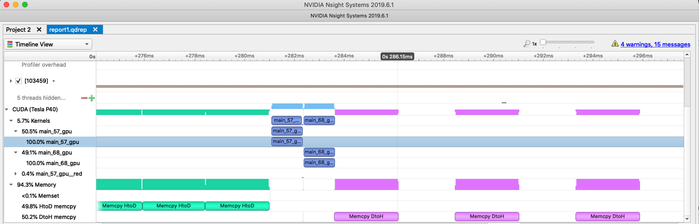
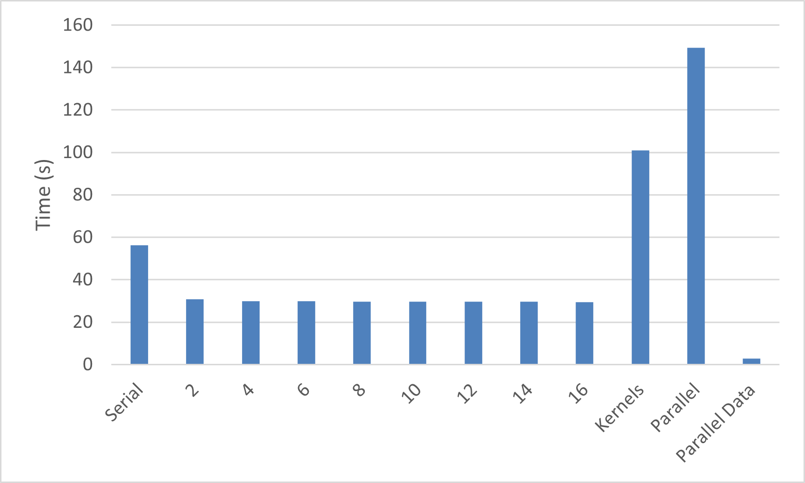

データ局所性の最適化
======================
前章の最後では、アプリケーションの最も計算集約的な部分をアクセラレータに移動したものの、ホストからアクセラレータへ、そしてその逆にデータをコピーするプロセスが、計算そのものよりもコストがかかる場合があることを確認しました。これは、コンパイラにとって、データが将来必要になるかどうか（または、いつ必要になるか）を判断することが難しいため、慎重にアプローチし、必要な場合に備えてデータを確実にコピーしなければならないからです。これを改善するために、アプリケーションの*データ局所性*を活用します。データ局所性とは、デバイスまたはホストメモリで使用されるデータが、必要な限りそのメモリにローカルに留まるべきであることを意味します。このアイデアは、データの再利用の最適化、またはホストとデバイスメモリ間の不要なデータコピーの最適化と呼ばれることもあります。どのように考えても、コンパイラが必要な時にのみデータを再配置できるようにするための情報を提供することが、OpenACCで成功するための鍵となることがよくあります。

----

プログラムの重要な領域の並列性を表現した後、並列領域で使用されるデータの局所性に関する追加情報をコンパイラに提供することが頻繁に必要になります。前のセクションで述べたように、コンパイラは慎重なアプローチでデータ移動を行い、プログラムが正しい結果を生成できるよう、必要となる可能性のあるデータを常にコピーします。プログラマは、どのデータが実際に必要で、いつ必要になるかについての知識を持っています。また、プログラマは、2つの関数間でデータがどのように共有される可能性があるかについての知識も持っており、これはコンパイラにとって判断が難しいことです。プロファイリングツールは、この章の最後のケーススタディで示すように、過剰なデータ移動が発生した時にプログラマが特定するのを助けることができます。

アクセラレーション・プロセスの次のステップは、デバイス上のデータの再利用を最大化し、データ転送を最小化するために、データ局所性に関する追加情報をコンパイラに提供することです。このステップの後に、ほとんどのアプリケーションがOpenACCアクセラレーションの恩恵を実感することになります。このステップは、ホストとデバイスが別々のメモリを持つマシンで主に有益です。

データ領域
------------
`data`構文は、複数の並列領域間でのデータの共有を容易にします。データ領域は、同じ関数内の1つ以上の並列領域の周りに追加することも、プログラムのコールツリーのより高いレベルに配置して、複数の関数内の領域間でデータを共有できるようにすることもできます。`data`構文は構造化構文であり、同じスコープ（同じ関数やサブルーチンなど）内で開始と終了をする必要があります。後のセクションでは、構造化構文が有用でない場合の処理方法について説明します。以前の`parallel loop`の例に`data`領域を追加して、両方のループネスト間でデータを共有できるようにすることができます。

~~~~ {.c .numberLines}
    #pragma acc data
    {
      #pragma acc parallel loop
        for (i=0; i<N; i++)
        {
          y[i] = 0.0f;
          x[i] = (float)(i+1);
        }
      
      #pragma acc parallel loop
        for (i=0; i<N; i++)
        {
          y[i] = 2.0f * x[i] + y[i];
        }
    }
~~~~

----

~~~~ {.fortran .numberLines}
    !$acc data
    !$acc parallel loop
    do i=1,N
      y(i) = 0
      x(i) = i
    enddo
  
    !$acc parallel loop
    do i=1,N
      y(i) = 2.0 * x(i) + y(i)
    enddo
    !$acc end data
~~~~

上記の例の`data`領域により、`x`と`y`配列を2つの`parallel`領域間で再利用できるようになります。これにより、2つの領域間で発生するデータコピーが削除されますが、最適なデータ移動が保証されるわけではありません。最適なデータ移動を実行するために必要な情報を提供するために、プログラマは`data`領域にデータ句を追加することができます。

*注意:* 暗黙的なデータ領域は、各`parallel`および`kernels`領域によって作成されます。

データ句
------------
データ句は、データがデバイスに作成され、デバイスとの間でコピーされるタイミングと方法について、プログラマに追加の制御を提供します。これらの句は、任意の`data`、`parallel`、または`kernels`構文に追加して、そのコード領域のデータニーズをコンパイラに通知できます。データディレクティブとその意味の簡単な説明を以下に示します。

* `copy` - リストされた変数用のスペースをデバイス上に作成し、領域の開始時にデバイスにデータをコピーして変数を初期化し、領域の終了時に結果をホストにコピーバックし、最後に完了時にデバイス上のスペースを解放します。
* `copyin` - リストされた変数用のスペースをデバイス上に作成し、領域の開始時にデバイスにデータをコピーして変数を初期化し、データをホストにコピーバックすることなく完了時にデバイス上のスペースを解放します。
* `copyout` - リストされた変数用のスペースをデバイス上に作成しますが、初期化はしません。領域の終了時に、結果をホストにコピーバックし、デバイス上のスペースを解放します。
* `create` - リストされた変数用のスペースを作成し、領域の終了時に解放しますが、デバイスとの間でコピーしません。
* `present` - リストされた変数はすでにデバイス上に存在しているため、それ以上のアクションは必要ありません。これは、より高レベルのルーチンにデータ領域が存在する場合に最も頻繁に使用されます。
* `deviceptr` - リストされた変数は、OpenACC外で管理されたデバイスメモリを使用しているため、アドレス変換なしでデバイス上で変数を使用する必要があります。この句は通常、OpenACCが別のプログラミングモデルと混在して使用される場合に使用され、相互運用性の章で説明されます。

`copy`、`copyin`、`copyout`、および`create`句の場合、参照された変数がすでにデバイスメモリ内に存在する場合、意図された機能は発生しません。これらの句には暗黙的な`present`句が付属していると考えると役立つ場合があります。変数がデバイス上に存在することが判明した場合、他の句は無視されます。この動作の重要な例は、変数がすでにデバイスメモリ内に存在する場合に`copy`句を使用しても、ホストとデバイス間でデータがコピーされないことです。データ領域内からホストとデバイス間でデータをコピーするための別のディレクティブがあり、これについてはすぐに説明します。

### 配列のシェイピング ###
コンパイラが並列領域またはデータ領域で使用される配列のサイズと形状を決定するために、追加のヘルプが必要な場合があります。ほとんどの場合、Fortranプログラマは自己記述型のFortran配列の性質に依存できますが、C/C++プログラマは、コンパイラがデバイス上に割り当てる配列の大きさとコピーする必要があるデータ量を知ることができるように、追加情報を与える必要があることがよくあります。この情報を提供するために、プログラマはデータ句に*shape*指定を追加します。

C/C++では、配列の形状は`x[start:count]`として記述されます。ここで、*x*は変数名、*start*はコピーする最初の要素、*count*はコピーする要素の数です。最初の要素が0の場合、省略することができ、`x[:count]`という形式になります。

Fortranでは、配列の形状は`x(start:end)`として記述されます。ここで、*x*は変数名、*start*はコピーする最初の要素、*end*はコピーする最後の要素です。*start*が配列の先頭であるか、*end*が配列の末尾である場合、省略することができ、`x(:end)`、`x(start:)`、または`x(:)`という形式になります。

配列のシェイピングは、OpenACCが関数呼び出し内に表示される場合や配列が動的に割り当てられる場合に、C/C++コードで頻繁に必要になります。これは、配列の形状がコンパイル時に知られないためです。シェイピングは、配列の一部のみをデバイスに格納する必要がある場合にも役立ちます。

配列シェイピングの例として、以下のコードは、各配列に形状情報を追加することで、以前の例を変更したものです。

~~~~ {.c .numberLines}
    #pragma acc data create(x[0:N]) copyout(y[0:N])
    {
      #pragma acc parallel loop
        for (i=0; i<N; i++)
        {
          y[i] = 0.0f;
          x[i] = (float)(i+1);
        }
      
      #pragma acc parallel loop
        for (i=0; i<N; i++)
        {
          y[i] = 2.0f * x[i] + y[i];
        }
    }
~~~~

----

~~~~ {.fortran .numberLines}
    !$acc data create(x(1:N)) copyout(y(1:N))
    !$acc parallel loop
    do i=1,N
      y(i) = 0
      x(i) = i
    enddo
  
    !$acc parallel loop
    do i=1,N
      y(i) = 2.0 * x(i) + y(i)
    enddo
    !$acc end data
~~~~

----

この例では、プログラマは`x`と`y`の両方がデバイス上でデータが入力されることを知っているため、どちらもホストからコピーされる必要はありません。ただし、`y`は`copyout`句内で使用されているため、`y`内に含まれるデータは、データ領域の終わりに達したときにデバイスからホストにコピーされます。これは、後でホストコードで`y`に格納された結果が必要な状況で役立ちます。

非構造化データライフタイム
---------------------------
構造化されたデータ領域は、多くのプログラムでデータ局所性を最適化するのに十分ですが、特にオブジェクト指向のコーディング慣行を使用する場合や、異なるコードファイル間でデバイスデータを管理したい場合など、一部のケースには十分ではありません。たとえば、C++クラスでは、データは頻繁にクラスコンストラクタで割り当てられ、デストラクタで割り当て解除され、クラスの外部からはアクセスできません。これにより、構造化されたデータ領域を使用することが不可能になります。構文を配置できる単一の構造化されたスコープが存在しないためです。このような状況では、非構造化データライフタイムを使用できます。`enter data`および`exit data`ディレクティブを使用して、デバイス上でデータを割り当ておよび割り当て解除するタイミングを正確に識別できます。

`enter data`ディレクティブは、`create`および`copyin`データ句を受け入れ、デバイス上でデータを作成するタイミングを指定するために使用できます。

`exit data`ディレクティブは、`copyout`と特別な`delete`データ句を受け入れ、デバイスからデータを削除するタイミングを指定します。

変数が複数の`enter data`ディレクティブに出現する場合、同等の数の`exit data`ディレクティブが使用された場合にのみ、デバイスから削除されます。データが確実に削除されるようにするには、`exit data`ディレクティブに`finalize`句を追加できます。さらに、変数が複数の`enter data`ディレクティブに出現する場合、最初のインスタンスのみがホストからデバイスへのデータ移動を実行します。`enter data`でデータが割り当てられた後、ホストとデバイス間でデータを移動する必要がある場合は、この章の後半で説明する`update`ディレクティブを使用する必要があります。

### C++クラスデータ ###
C++クラスデータは、非構造化データライフタイムがOpenACCに追加された主な理由の1つです。上記で説明したように、クラスによって提供されるカプセル化により、構造化された`data`領域を使用してクラスデータの局所性を制御することが不可能になります。プログラマは、C++クラス内でデータ局所性を制御するために、非構造化データライフタイムディレクティブまたはOpenACC APIを使用することを選択できます。ディレクティブの使用が望ましいです。非OpenACCコンパイラによって安全に無視されるためですが、ディレクティブがプログラマのニーズを満たすのに十分な表現力がない場合のために、APIも利用可能です。このガイドではAPIについては説明しませんが、OpenACCウェブサイトに十分に文書化されています。

以下の例は、コンストラクタ、デストラクタ、およびコピーコンストラクタを持つ単純なC++クラスを示しています。これらのルーチンのデータ管理は、OpenACCディレクティブを使用して処理されています。

~~~~ {.cpp .numberLines}
    template <class ctype> class Data
    {
      private:
        /// Length of the data array
        int len;
        /// Data array
        ctype *arr;
    
      public:
        /// Class constructor
        Data(int length)
        {
          len = length;
          arr = new ctype[len];
    #pragma acc enter data copyin(this)
    #pragma acc enter data create(arr[0:len])
        }

        /// Copy constructor
        Data(const Data<ctype> &d)
        {
          len = d.len;
          arr = new ctype[len];
    #pragma acc enter data copyin(this)
    #pragma acc enter data create(arr[0:len])
    #pragma acc parallel loop present(arr[0:len],d)
          for(int i = 0; i < len; i++)
            arr[i] = d.arr[i];
        }

        /// Class destructor
        ~Data()
        {
    #pragma acc exit data delete(arr)
    #pragma acc exit data delete(this)
          delete arr;
          len = 0;
        }
    };
~~~~

クラスコンストラクタに`enter data`ディレクティブが追加され、デバイス上のクラスデータ用のスペースを作成する処理が行われていることに注意してください。データ配列自体に加えて、`this`ポインタがデバイスにコピーされます。`this`ポインタをコピーすることで、データ配列`arr`の長さを示すスカラーメンバ`len`とポインタ`arr`が、ホストだけでなくアクセラレータでも使用できるようになります。`enter data`ディレクティブは、クラスデータが初期化された後に配置することが重要です。同様に、`exit data`ディレクティブがデストラクタに追加され、デバイスメモリのクリーンアップが処理されます。このディレクティブは、配列メンバが解放される前に配置することが重要です。ホストコピーが解放されると、基礎となるポインタが無効になる可能性があり、デバイスメモリも解放できなくなる可能性があるためです。同じ理由で、`this`ポインタは、他のすべてのメモリが解放されるまでデバイスから削除しないでください。

コピーコンストラクタは、独自に見る価値のある特殊なケースです。コピーコンストラクタは、作成しているクラスのためにデバイス上にスペースを割り当てる責任がありますが、コピーされるクラスによって管理されるデータにも依存します。OpenACCは現在、ホスト上の`memcpy`のように、ある配列から別の配列にコピーするポータブルな方法を提供していないため、ループを使用して各個別要素をある配列から別の配列にコピーします。渡された`Data`オブジェクトのメンバもデバイス上にあることがわかっているため、`parallel loop`で`present`句を使用して、データ移動が不要であることをコンパイラに通知します。

----

上記のクラスコンストラクタとデストラクタで使用されている同じ手法は、他のプログラミング言語でも使用できます。たとえば、Fortranコードでは、モジュール内に含まれるすべての配列を割り当てて初期化するサブルーチンを持つことが一般的です。このようなルーチンは、コード内の同じルーチン内にホストメモリとデバイスメモリの両方の割り当てが表示されるため、`enter data`領域を使用する自然な場所です。`enter data`および`exit data`ディレクティブをコード内の通常のデータの割り当てと割り当て解除の近くに配置することで、コードのメンテナンスが簡素化されます。

更新ディレクティブ
----------------
データをアクセラレータ上に常駐させておくことは、多くの場合、高いパフォーマンスを得るための鍵ですが、ホストとデバイスメモリ間でデータをコピーする必要がある場合があります。`update`ディレクティブは、ホストまたはデバイスメモリの値を他方の値で明示的に更新する方法を提供します。これは、2つのメモリの内容を同期すると考えることができます。`update`ディレクティブは、ホストからデバイスにデータをコピーするための`device`句と、デバイスからローカルメモリ（ホストメモリ）に更新するための`self`句を受け入れます。

`update`ディレクティブの例として、以下は、上記の`Data`クラスに追加して、ホストからデバイスへ、およびデバイスからホストへの強制コピーを行う2つのルーチンです。

~~~~ {.c .numberLines}
    void update_host()
    {
    #pragma acc update self(arr[0:len])
      ;
    }
    void update_device()
    {
    #pragma acc update device(arr[0:len])
      ;
    }
~~~~

更新句は、すでにデータ句のセクションで説明したように、配列の形状を受け入れます。上記の例では、配列全体`arr`をデバイスとの間でコピーしていますが、境界条件の交換など、配列の一部のみを更新する必要がある場合にデータ転送コストを削減するために、部分配列を提供することもできます。

***ベストプラクティス:*** ドキュメントの前半で述べたように、OpenACCコード内の変数は、*ホスト*コピーと*デバイス*コピーではなく、常に単一のオブジェクトと考えるべきです。統合されたホストとデバイスメモリを持つマシンで開発している場合でも、以前に他方によって書き込まれたホストまたはデバイスからデータにアクセスするときは常に`update`ディレクティブを含めることが重要です。これにより、すべてのデバイスでの正確性が保証されます。個別のメモリを持つシステムでは、`update`はホストとデバイス上の影響を受ける変数の値を同期します。統合メモリを持つデバイスでは、更新は無視され、パフォーマンスのペナルティは発生しません。以下の例では、17行目の`update`を省略すると、統合メモリと非統合メモリのマシンで異なる結果が生成され、コードが移植不可能になります。


~~~~ {.c .numberLines}
    for(int i=0; i<N; i++)
    {
      a[i] = 0;
      b[i] = 0;
    }
    
    #pragma acc enter data copyin(a[0:N])
    
    #pragma acc parallel loop
    {
      for(int i=0; i<N; i++)
      {
        a[i] = 1; 
      }
    }
    
    #pragma acc update self(a[0:N])
    
    for(int i=0; i<N; i++)
    {
      b[i] = a[i];  
    }
    
    #pragma acc exit data
~~~~

<!---
Cache Directive
---------------
***Delaying slightly because the cache directive is still being actively
improved in the PGI compiler.***

Some parallel accelerators, GPUs in particular, have a high-speed memory that
can serve as a user-managed cache. OpenACC provides a mechanism for declaring
arrays and parts of arrays that would benefit from utilizing a fast memory if
it's available within each gang. The `cache` directive may be placed within a
loop and specify the array or array section should be placed in a fast memory
for the extent of that loop.

Global Data
-----------
***Discuss `declare` directive.***

When dealing with global data, such as variables that are declared globally,
static to the file, or extern in C and C++ or common blocks and their contained
data in Fortran, data regions and unstructured data directives are not
sufficient. In these cases it is necessary to use the `declare` directive to
declare that these variables should be available on the device. The `declare`
directive has many complexities, which will be discussed as needed, so this
section will only discuss it in the context of global variables in C anc C++
and common blocks in Fortran.
--->

ベストプラクティス: データ局所性を維持するために非効率な操作をオフロード
-----------------------------------------------------------------------
ホストとデバイスメモリが個別のシステムでは、PCIeデータ転送のコストが高いため、コードに十分な並列性がなく直接的な利益が得られない場合でも、アプリケーションのセクションをアクセラレータデバイスに移動することが有益な場合がよくあります。並列アクセラレータ上で、シリアルまたは並列度の低いコードを実行することによるパフォーマンス損失は、2つのメモリ間で配列を転送するコストよりも少ないことがよくあります。開発者は、コードのシリアルセクションをアクセラレータにオフロードする方法として、1つのギャングだけを持つ`parallel`領域を使用できます。たとえば、以下のコードでは、配列の最初と最後の要素は、ゼロに設定する必要があるホスト要素です。`parallel`領域（`loop`なし）を使用して、シリアルな部分を実行します。

~~~~ {.c .numberLines}
    #pragma acc parallel loop
    for(i=1; i<(N-1); i++)
    {
      // calculate internal values
      A[i] = 1;
    }
    #pragma acc parallel
    {
      A[0]   = 0;
      A[N-1] = 0;
    }
~~~~

---

~~~~ {.fortran .numberLines}
    !$acc parallel loop
    do i=2,N-1
      ! calculate internal values
      A(i) = 1
    end do
    !$acc parallel
      A(1) = 0;
      A(N) = 0;
    !$acc end parallel
~~~~

上記の例では、2番目の`parallel`領域は、最初と最後の要素を設定するための小さなカーネルを生成して起動します。小さなカーネルは通常、GPUなどの一部のオフロードデバイスでカーネル起動のコストを克服するのに十分な時間実行されません。この手法を採用することで節約されるデータ転送が、一部のデバイスでのカーネル起動の高いコストを克服するのに十分な大きさであることが重要です。`parallel loop`と2番目の`parallel`領域の両方を非同期にして（後の章で説明）、2番目のカーネル起動のコストを削減することができます。

*注意: `kernels`ディレクティブは、コンパイラに並列性を検索するように指示するため、`kernels`には同様の手法はありませんが、上記の`parallel`アプローチは、`kernels`領域の間に簡単に配置できます。*

ベストプラクティス: C++のEnd/Lastポインタの処理
-------------------------------------------------
C++のlist/array様オブジェクトでは、2つのポインタを格納することが一般的な慣行です。1つは最初の要素へのポインタで、もう1つは最後の要素の直後のメモリアドレスを指すポインタです。このパターンは、たとえばC++標準テンプレートライブラリに見られます。以下は例です:

```cpp
  const size_t N = 1024;
  float *first = (float*)malloc(N * sizeof(float));
  float *last = first + N; // Beyond the allocated memory
```

このパターンは、単一のアドレス空間を持つマシンでは問題なく機能しますが、ホストとデバイスメモリ空間が個別のマシンでは問題になる可能性があります。`parallel`または`serial`領域で使用されるスカラーポインタ変数のデフォルトの動作は、ポインタを`firstprivate`句に出現したかのように暗黙的に扱うことです。ただし、個別メモリマシンで破損する以下のコードを検討してください。

```cpp
#pragma acc parallel loop copy(first[0:1024])
  for (int i = 0; i < 1024 ; i++)
  {
    // first is a device address
    // last is a host address
    if ( first != last )
    {
      first[i] = (float)i;
    }
  }
```

`first`がデバイスにコピーされているため、`parallel`領域内ではデバイスアドレスが使用されますが、`last`は暗黙的にfirstprivateであるため、ホストアドレスが含まれます。`last`ポインタは実際にはデータを指しておらず、デバイスメモリ内の`first`との相対関係を維持する必要があるため、コピーしようとすることは意味がありません。ただし、この問題には直感的でない解決策があります。

```cpp
#include <cstdio>
#include <cstdlib>
int main(int argc, char **argv)
{
  float *first = (float*)malloc(1024 * sizeof(float));
  float *last = first + 1024;
  #pragma acc parallel loop copy(first[0:1024]) copy(last[-1:0])
  for (int i = 0; i < 1024 ; i++)
  {
    if ( first != last )
    {
      first[i] = (float)i;
    }
  }
  printf("[%d] %f : [%d] %f\n", 0, first[0], 1023, first[1023]);
  free(first);
  return 0;
}
```

この例では、`last`の直前の要素をコピーし、ゼロ要素をコピーしています。これは驚くべきことかもしれません。C++には任意の配列境界がなく、ゼロ要素をコピーすることは無意味に見えるためです。ただし、何が起こるかというと、`last`のプレゼントテーブルエントリが作成され、`last`の前の要素をコピーするように指示しているため、すでにデバイス上に存在するデータをコピーしています（これは追加のデータをコピーしないと定義されています）。この変更により、`first`と`last`の両方がデバイスアドレスを使用し、同じベースアドレスとの相対関係になります。

***注意:*** この記述のとおり、このコードはデータ句が左から右に評価されることを前提としていますが、これは厳密には要求されていません。右から左に処理された場合、2つの領域間の重複により、部分的にプレゼントエラーが発生する可能性があります。メモリの一部がすでにプレゼントテーブルに存在するためです。執筆時点では、OpenACC 3.4が現在のバージョンであり、この問題を防ぐために操作の順序をより厳密に定義することは、延期されたトピックです。

ケーススタディ - データ局所性の最適化
-----------------------------------
前章の終わりまでに、サンプルコードの主要な計算ループを移動し、その過程で大量の暗黙的なデータ転送を導入しました。コードのパフォーマンスプロファイルは、各反復で`A`と`Anew`配列が*host*と*device*の間で4回（`parallel loop`バージョン）および2回（`kernels`バージョン）コピーされていることを示しています。これらの配列の値は、解が収束した後まで必要ないことを考えると、収束ループの周りにデータ領域を追加しましょう。さらに、これらの配列がこのデータ領域によってどのように管理されるべきかを指定する必要があります。`A`配列の初期値と最終値の両方が必要なため、その配列には`copy`データ句が必要です。ただし、`Anew`配列の結果は、このコードのセクション内でのみ使用されるため、`create`句が使用されます。結果のコードを以下に示します。

*注意: このステップ中に必要な変更は、コードの両方のバージョンで同じであるため、`parallel loop`バージョンのみが表示されます。*

~~~~ {.c .numberLines startFrom="51"}
    #pragma acc data copy(A[:n][:m]) create(Anew[:n][:m])
        while ( error > tol && iter < iter_max )
        {
            error = 0.0;
    
            #pragma acc parallel loop reduction(max:error)
            for( int j = 1; j < n-1; j++)
            {
                #pragma acc loop reduction(max:error)
                for( int i = 1; i < m-1; i++ )
                {
                    Anew[j][i] = 0.25 * ( A[j][i+1] + A[j][i-1]
                                        + A[j-1][i] + A[j+1][i]);
                    error = fmax( error, fabs(Anew[j][i] - A[j][i]));
                }
            }
    
           #pragma acc parallel loop
            for( int j = 1; j < n-1; j++)
            {
                #pragma acc loop
                for( int i = 1; i < m-1; i++ )
                {
                    A[j][i] = Anew[j][i];
                }
            }
    
            if(iter % 100 == 0) printf("%5d, %0.6f\n", iter, error);
    
            iter++;
        }
~~~~    
      
----

~~~~ {.fortran .numberLines startFrom="51"}
    !$acc data copy(A) create(Anew)
    do while ( error .gt. tol .and. iter .lt. iter_max )
      error=0.0_fp_kind
        
      !$acc parallel loop reduction(max:error)
      do j=1,m-2
        !$acc loop reduction(max:error)
        do i=1,n-2
          A(i,j) = 0.25_fp_kind * ( Anew(i+1,j  ) + Anew(i-1,j  ) + &
                                    Anew(i  ,j-1) + Anew(i  ,j+1) )
          error = max( error, abs(A(i,j) - Anew(i,j)) )
        end do
      end do

      !$acc parallel loop
      do j=1,m-2
        !$acc loop
        do i=1,n-2
          A(i,j) = Anew(i,j)
        end do
      end do

      if(mod(iter,100).eq.0 ) write(*,'(i5,f10.6)'), iter, error
      iter = iter + 1
    end do
    !$acc end data
~~~~    

この変更により、収束ループで必要な最大エラーに対して計算された値のみが、毎回の反復でデバイスからコピーされます。`A`と`Anew`配列は、この計算の範囲を通じてデバイスにローカルのままです。NVIDIA NSight Systemsを再度使用すると、各データ転送がデータ領域の開始と終了時にのみ発生し、各反復間の時間がはるかに少ないことがわかります。



このコードの最終的なパフォーマンスを見ると、GPU上のOpenACCコードの時間は、最良のスレッド化されたCPUコードよりもはるかに高速になっていることがわかります。パフォーマンスグラフには`parallel loop`バージョンのみが表示されていますが、`kernels`バージョンも`data`領域を追加すると同様に良好なパフォーマンスを発揮します。



これでJacobi反復のケーススタディは終わりです。この実装の単純さは一般的に、OpenACCで非常に良好なスピードアップを示し、多くの場合、さらなる改善の余地がほとんど残されていません。ただし、読者は、興味のあるデバイスでさらなる改善が可能かどうかを確認するために、このコードを再訪することをお勧めします。
