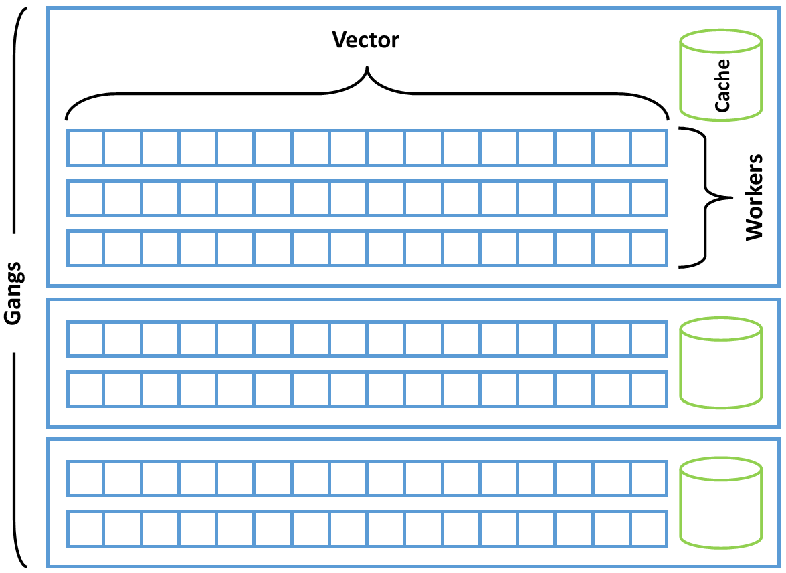
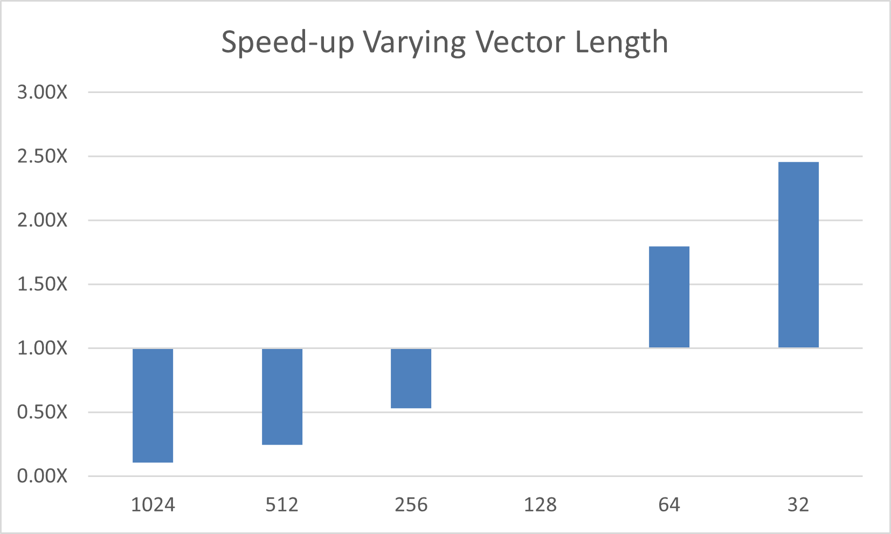
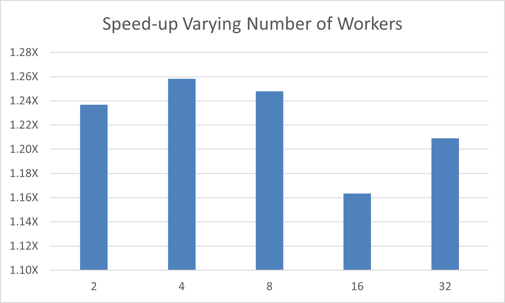

ループの最適化
==============
データ局所性が表現されると、開発者は対象のハードウェアに向けてさらにコードをチューニングしたいと考えるかもしれません。ループを特定のハードウェアタイプ向けにチューニングすればするほど、そのコードは他のアーキテクチャへの性能移植性が低くなることを理解することが重要です。ただし、特定のアクセラレータで主に実行している場合は、ループを基盤となるハードウェアにどのようにマッピングするかをチューニングすることで、いくらかの性能向上が得られる可能性があります。

すべてのデータ局所性がコードで表現される前に、ループのチューニングを始めたくなることがあります。しかし、データコピーが現世代のアクセラレータにおけるアプリケーション性能の制限要因であることが多いため、データ局所性が最適化されるまでは、特定のループをチューニングすることによる性能への影響を測定することが難しすぎる場合があります。このため、ベストプラクティスは、すべてのデータ局所性がコードで表現され、データ転送時間が最小限に抑えられてから、特定のループを最適化するまで待つことです。

効率的なループの順序
-----------------------
OpenACCがループを対象のハードウェアにマッピングする方法を変更する前に、開発者は重要なループを調べて、データ配列が効率的な方法でアクセスされていることを確認する必要があります。大きなキャッシュとSIMD演算を持つCPUであれ、合体メモリアクセスとSIMT演算を持つGPUであれ、ほとんどの最新のハードウェアは、配列に*ストライド1*の方法でアクセスすることを好みます。つまり、各ループ反復が連続したメモリアドレスにアクセスすることです。これは、ループネストの最内側のループが最も速く変化する配列の次元で反復し、外側の各連続するループが次に速く変化する次元にアクセスするようにすることで実現されます。ループをこのように増加する順序で配置すると、キャッシュ効率が向上し、ほとんどのアーキテクチャでベクトル化が改善されることがよくあります。

OpenACCの3つの並列性レベル
---------------------------------
OpenACCは、*gang*、*worker*、*vector*という3つの並列性レベルを定義しています。さらに、実行を逐次的(*seq*)としてマークすることもできます。ベクトル並列性は最も細かい粒度を持ち、単一の命令が複数のデータに対して演算を実行します(最新のCPUの*SIMD*並列性や最新のGPUの*SIMT*並列性に似ています)。ベクトル演算は特定の*ベクトル長*で実行され、同じ命令で演算できるデータ要素の数を示します。gang並列性は粗粒度の並列性であり、gangは互いに独立して動作し、同期することはありません。worker並列性はvectorとgangのレベルの間にあります。gangは1つ以上のworkerから構成され、各workerは何らかの長さのベクトルを操作します。gang内で、OpenACCモデルは*キャッシュ*メモリを公開し、gang内のすべてのworkerとvectorが使用できます。また、gang内で同期することは合法ですが、OpenACCはユーザーに同期を公開していません。これら3つの並列性レベルと逐次実行を使用して、プログラマはコード内の並列性を任意のデバイスにマッピングできます。ただし、OpenACCはプログラマに明示的にこのマッピングを行うことを要求していません。プログラマがループを対象のデバイスに明示的にマッピングしない場合、コンパイラはターゲットデバイスについて知っていることを使用して、暗黙的にこのマッピングを実行します。これにより、同じコードを任意の数のターゲットデバイスにマッピングできるため、OpenACCは高い移植性を持ちます。ただし、プログラマがコードに追加する並列性の明示的なマッピングが多いほど、コードは他のアーキテクチャへの移植性が低くなります。

### OpenACCの3つの並列性レベルを理解する

_gang_、_worker_、_vector_という用語は、ほとんどのプログラマにとって馴染みがないため、これら3つの並列性レベルの意味は、OpenACCの初心者プログラマにはしばしば理解されません。これら3つのレベルを理解するのに役立つ実用的な例を以下に示します。アパートを塗装する必要があるとします。ローラーとペンキのバケツを持った1人の人は、小さなアパートを数時間、おそらく1日で塗装することができます。小さなアパートの場合、1人の塗装工で仕事を完了するには十分ですが、大きな多階建てビルのすべてのアパートを塗装する必要がある場合はどうでしょうか。その場合、1人で完了するにはかなり困難な仕事です。この塗装工がより速く作業するために試すことができるいくつかのトリックがあります。1つの選択肢は、より速く作業し、腕が管理できる限り速くローラーを壁に動かすことです。しかし、人間が実際にペイントローラーを使用できる速さには実際的な限界があります。別の選択肢は、より大きなペイントローラーを使用することです。おそらく、塗装工は4インチのペイントローラーから始めたので、8インチのローラーにアップグレードすれば、同じ時間で2倍の壁面積をカバーできます。なぜそこで止まるのでしょうか？より多くの壁面積を1ストロークでカバーするために32インチのペイントローラーを購入しましょう！ここで、異なる問題に直面し始めます。たとえば、塗装工の腕はおそらく8インチのローラーほど速く32インチのローラーを動かすことができないため、これが実際に速いという保証はありません。さらに、より広いローラーは、ローラーが収まるように、または広いローラーはペンキで満たすのに時間がかかるかもしれないため、塗装工がすでに塗装した場所に再度塗装しなければならないぎこちない時間が生じる可能性があります。いずれにしても、1人の塗装工がどれだけ速く仕事を完了できるかには明確な限界があるため、さらに塗装工を招待しましょう。

ここで、4人の塗装工が仕事をしていると仮定します。独立した領域を塗装するように割り当てられた場合、仕事はほぼ4倍速く完了するはずですが、4倍の数のローラー、ペイント皿、ペンキの缶を取得するコストがかかります。これはおそらく、仕事をほぼ4倍速く完了するために支払う小さな代償です。ただし、大きな仕事には大きなチームが必要なので、塗装工の数を16人に再度増やしましょう。各塗装工が独立して作業できる場合、塗装を完了するのにかかる時間はおそらく再び4分の1に減少しますが、今では他のいくつかの非効率性があるかもしれません。たとえば、小さなペンキ缶ではなく、大きなペンキバケツを購入する方がおそらく安いので、それらのバケツをすべての人がアクセスできる中央の場所に保管します。塗装工が缶を補充する必要がある場合、ペンキを取りに歩かなければならず、それが塗装時間を奪います。ここでアイデアがあります。16人の塗装工を4人の塗装工の4つのグループに整理し、各グループがそれぞれ共有する独自のバケツを持つようにしましょう。これで、各チーム内の塗装工がチームの他のメンバーの近くで作業している限り、ペンキを取りに行く歩行時間ははるかに短くなりますが、チームは依然として互いに完全に独立して作業できます。

この類推では、OpenACCと同様に3つの並列性レベルがあります。最も細かい粒度のレベルは完全には明白ではないかもしれませんが、それはローラーのサイズです。ローラーの幅は、塗装工が各ストロークで塗装できる壁の量を決定します。より広いローラーは、ある限界まで、ストローク当たりより多くの壁を意味します。次に、各チーム内の並列な塗装工がいます。これらの塗装工は、互いにほぼ独立して作業できますが、時々共有のペンキバケツにアクセスしたり、次の近くの作業を調整したりする必要があります。最後に、チームがあります。これらは互いに完全に独立して作業でき、異なる時間に作業することさえあり(日勤と夜勤を考えてください)、階層における最も粗い粒度の並列性を表します。

OpenACCでは、_gangs_は作業チームのようなもので、互いに完全に独立しており、並列で動作したり、異なる時間に動作したりすることがあります。_Workers_は個々の塗装工で、独自に動作できますが、同じ_gang_の他の_workers_とリソースを共有することもあります。最後に、ペイントローラーは_vector_を表し、ローラーの幅は_vector length_を表します。_Workers_は、_vector_演算を使用して複数のデータ要素に対して同じ命令を実行します。したがって、_gangs_は少なくとも1つの_worker_で構成され、それがデータの_vector_を操作します。

ハードウェアへの並列性のマッピング
-----------------------------------
基盤となるアクセラレータハードウェアがどのように動作するかについてのいくらかの理解があれば、コンパイラにループ反復をハードウェアへの並列性にどのようにマッピングするかを通知することが可能です。特定のアクセラレータへの並列性のマッピング方法についてより詳細な情報をコンパイラに提供するほど、コードの性能移植性が低くなることを繰り返し述べる価値があります。たとえば、固定のベクトル長を設定すると、あるプロセッサで性能が向上し、別のプロセッサで性能が妨げられる可能性があります。または、ループの実行に使用されるgangの数を固定すると、より高度な並列性を持つプロセッサでの性能が制限される可能性があります。

このガイドで前述したように、`loop`ディレクティブは、コード内の次のループに関する追加情報をコンパイラに提供することを目的としています。正しさを保証することを目的とした前述の句に加えて、以下の句は、指定されたループに使用すべき並列性のレベルをコンパイラに通知します。

* Gang句 - ループをgang間で分割
* Worker句 - ループをworker間で分割
* Vector句 - ループをベクトル化
* Seq句 - このループを分割せず、代わりに逐次的に実行

これらのディレクティブは、特定のループ上で組み合わせることもできます。たとえば、`gang vector`ループはgang間で分割され、各gangは暗黙的に1つのworkerを持ち、その後ベクトル化されます。OpenACC仕様は、最外側のループがgangループでなければならず、最内側の並列ループがvectorループでなければならず、workerループはその間に現れることができることを強制します。逐次ループは任意のレベルに現れることができます。

~~~~ {.c .numberLines}
    #pragma acc parallel loop gang
    for ( i=0; i<N; i++)
      #pragma acc loop vector
      for ( j=0; j<M; j++)
        ;
~~~~

--

~~~~ {.fortran .numberLines}
    !$acc parallel loop gang
    do j=1,M
      !$acc loop vector
      do i=1,N
~~~~

コンパイラにループをどこで分割するかを通知することは、ループの最適化の一部に過ぎません。プログラマはさらに、ループに使用する特定のgang数、worker数、またはベクトル長をコンパイラに伝えることができます。この特定のマッピングは、`kernels`ディレクティブを使用する場合と`parallel`ディレクティブを使用する場合では、わずかに異なる方法で実現されます。`kernels`ディレクティブの場合、`gang`、`worker`、`vector`句は整数パラメータを受け入れ、そのレベルの並列性をどのように分割するかをコンパイラにオプションで通知します。たとえば、`vector(128)`は、ループにベクトル長128を使用するようコンパイラに通知します。

~~~~ {.c .numberLines}
    #pragma acc kernels
    {
    #pragma acc loop gang
    for ( i=0; i<N; i++)
      #pragma acc loop vector(128)
      for ( j=0; j<M; j++)
        ;
    }
~~~~

---

~~~~ {.fortran .numberLines}
    !$acc kernels
    !$acc loop gang
    do j=1,M
      !$acc loop vector(128)
      do i=1,N

    !$acc end kernels
~~~~

`parallel`ディレクティブを使用する場合、情報は各個別のループではなく`parallel`ディレクティブ自体に提示され、`parallel`ディレクティブへの`num_gangs`、`num_workers`、`vector_length`句の形式で提供されます。

~~~~ {.c .numberLines}
    #pragma acc parallel loop gang vector_length(128)
    for ( i=0; i<N; i++)
      #pragma acc loop vector
      for ( j=0; j<M; j++)
        ;
~~~~

---

~~~~ {.fortran .numberLines}
    !$acc parallel loop gang vector_length(128)
    do j=1,M
      !$acc loop vector
      do i=1,N
~~~~

これらのマッピングは異なるアクセラレータ間で異なるため、`loop`ディレクティブは`device_type`句を受け入れ、これらの句が特定のデバイスタイプにのみ適用されることをコンパイラに通知します。`device_type`句の後の句は、次の`device_type`またはディレクティブの終わりまで、指定されたデバイスにのみ適用されます。すべての`device_type`句の前に現れる句は、後の句で上書きされない限り使用されるデフォルト値と見なされます。たとえば、以下のコードは、タイプ`acc_device_nvidia`のデバイスではベクトル長128を使用し、タイプ`acc_device_radeon`のデバイスではベクトル長256を使用する必要があることを指定しています。コンパイラは他のすべてのデバイスタイプに対してデフォルトのベクトル長を選択します。

~~~~ {.c .numberLines}
    #pragma acc parallel loop gang vector \
                device_type(acc_device_nvidia) vector_length(128) \
                device_type(acc_device_radeon) vector_length(256)
    for (i=0; i<N; i++)
    {
      y[i] = 2.0f * x[i] + y[i];
    }
~~~~

Collapse句
---------------
コードに密に入れ子になったループが含まれている場合、これらのループを単一のループに*折りたたむ*ことがしばしば有益です。ループを折りたたむということは、それぞれトリップカウントがNとMの2つのループが、自動的にトリップカウントがN×Mの単一のループに変換されることを意味します。2つ以上の並列ループを単一のループに折りたたむことで、コンパイラはコードをデバイスにマッピングする際に使用できる並列性の量が増加します。GPUなどの高度に並列なアーキテクチャでは、これによりパフォーマンスが向上する可能性があります。さらに、ループ自体が十分な並列性を持っていなかった場合、別のループと折りたたむことで、利用可能な並列性が倍増します。これは、ベクトルループで特に有益です。なぜなら、一部のハードウェアタイプは、他のハードウェアタイプよりも高いパフォーマンスを達成するためにより長いベクトル長を必要とするからです。gangループを折りたたむことも、高度に並列なプロセッサのためにより多くのgangを生成できるようになる場合に有益です。以下のコードは、collapseディレクティブの使用方法を示しています。

~~~~ {.c .numberLines}
    #pragma acc parallel loop gang collapse(2)
    for(ie = 0; ie < nelemd; ie++) {
      for(q = 0; q < qsize; q++) {
        #pragma acc loop vector collapse(3)
        for(k = 0; k < nlev; k++) {
          for(j = 0; j < np; j++) {
            for(i = 0; i < np; i++) {
              qtmp = elem[ie].state.qdp[i][j][k][q][n0_qdp];
              vs1tmp = vstar[i][j][k][0][ie] * elem[ie].metdet[i][j] * qtmp;
              vs2tmp = vstar[i][j][k][1][ie] * elem[ie].metdet[i]]j] * qtmp;
              gv[i][j][k][0] = (dinv[i][j][0][0][ie] * vs1tmp + dinv[i][j][0][1][ie] * vs2tmp);
              gv[i][j][k][1] = (dinv[i][j][1][0][ie] * vs1tmp + dinv[i][j][1][1][ie] * vs2tmp);
            }
          }
        }
      }
    }
~~~~

---

~~~~ {.fortran .numberLines}    
    ! $acc parallel loop gang collapse (2)
    do ie = 1 , nelemd
      do q = 1 , qsize
        ! $acc loop vector collapse (3)
        do k = 1 , nlev
          do j = 1 , np
            do i = 1 , np
              qtmp = elem (ie )% state % qdp (i,j,k,q, n0_qdp )
              vs1tmp = vstar (i,j,k ,1, ie) * elem (ie )% metdet (i,j) * qtmp
              vs2tmp = vstar (i,j,k ,2, ie) * elem (ie )% metdet (i,j) * qtmp
              gv(i,j,k ,1) = ( dinv (i,j ,1 ,1 , ie )* vs1tmp + dinv (i,j ,1 ,2, ie )* vs2tmp )
              gv(i,j,k ,2) = ( dinv (i,j ,2 ,1 , ie )* vs1tmp + dinv (i,j ,2 ,2, ie )* vs2tmp )
            enddo
          enddo
        enddo
      enddo
    enddo
~~~~

上記のコードは、ループを折りたたむことで利用可能な並列性が拡張された実際のアプリケーションからの抜粋です。1行目では、最も外側の2つのループが一緒に折りたたまれ、両方のループの反復にわたって*gangs*を生成することが可能になり、可能なgang数が`nelemd`だけではなく`nelemd` x `qsize`になります。4行目の折りたたみは、3つの小さなループを一緒に折りたたして、可能な*ベクトル長*を増やします。なぜなら、ループのどれも、ターゲットアクセラレータで合理的なベクトル長を作成するのに十分な反復回数で反復しないからです。この最適化がコードをどれだけ高速化するかは、アプリケーションとターゲットアクセラレータによって異なりますが、ループネストでcollapseを使用することで大幅な高速化が見られることは珍しくありません。

ルーチンの並列性
-------------------
前の章では、OpenACC並列領域から関数とサブルーチンを呼び出すための`routine`ディレクティブを紹介しました。その章では、ルーチンは各ループ反復から呼び出されると想定されていたため、`routine seq`ディレクティブが必要でした。場合によっては、ルーチン自体にデバイスにマッピングする必要がある並列性が含まれていることがあります。これらの場合、`routine`ディレクティブは、`seq`の代わりに`gang`、`worker`、または`vector`句を持つことができ、ルーチンが指定されたレベルの並列性を含むことをコンパイラに通知します。これは、そのルーチンのループのために特定のレベルの並列性を_予約する_と考えることができます。これにより、コンパイラが影響を受けるルーチンの呼び出しサイトに遭遇したときに、ルーチンを使用するためにコードをどのように並列化できるかを知ることができます。`acc routine`が別のルーチンを呼び出す場合、そのルーチンにも`acc routine`ディレクティブが必要であることに注意することが重要です。現時点では、OpenACC仕様は、単一のルーチンに複数の可能な並列性レベルを指定することを許可していません。

ケーススタディ - ループの最適化
---------------------------
このケーススタディは、前の章とは異なるアルゴリズムに焦点を当てています。コンパイラがループに関する十分な情報を持って情報に基づいた決定を下すことができる場合、特定の並列ループの性能を数パーセント以上改善することはしばしば困難です。場合によっては、コードには、コンパイラが情報に基づいた最適化決定を下すために必要な情報が不足しています。これらの場合、開発者は、コンパイラに並列性をハードウェアに分解および分散する方法を通知することで、並列ループを大幅に最適化できることがよくあります。

このセクションで使用されるコードは、スパース行列ベクトル積(SpMV)演算を実装しています。これは、行列とベクトルが乗算されることを意味しますが、行列にはゼロでない要素が非常に少なく(*スパース*)、これらの値を計算することは不要です。行列は圧縮スパース行(CSR)形式で保存されます。CSRでは、値がゼロのセルを多数含む可能性があるスパース配列は、大量のメモリを浪費するため、3つの小さな配列を使用して保存されます。1つは行列からの非ゼロ値を含み、2つ目は特定の行でこれらの非ゼロ要素が存在する場所を記述し、3つ目はデータが存在する列を記述します。この演習のコードは以下の通りです。

~~~~ {.c .numberLines}
    #pragma acc parallel loop
    for(int i=0;i<num_rows;i++) {
      double sum=0;
      int row_start=row_offsets[i];
      int row_end=row_offsets[i+1];
      #pragma acc loop reduction(+:sum)
      for(int j=row_start;j<row_end;j++) {
        unsigned int Acol=cols[j];
        double Acoef=Acoefs[j];
        double xcoef=xcoefs[Acol];
        sum+=Acoef*xcoef;
      }
      ycoefs[i]=sum;
    }
~~~~

---

~~~~ {.fortran .numberLines}
    !$acc parallel loop
    do i=1,a%num_rows
      tmpsum = 0.0d0
      row_start = arow_offsets(i)
      row_end   = arow_offsets(i+1)-1
      !$acc loop reduction(+:tmpsum)
      do j=row_start,row_end
        acol = acols(j)
        acoef = acoefs(j)
        xcoef = x(acol)
        tmpsum = tmpsum + acoef*xcoef
      enddo
      y(i) = tmpsum
    enddo
~~~~

このコードについて注目すべき重要なことの1つは、コンパイラが各行に含まれる非ゼロの数を決定し、その情報を使用してループをスケジュールすることができないことです。ただし、開発者は、行ごとの非ゼロ要素の数が非常に少ないことを知っており、この詳細が高性能を達成する鍵となります。

***注:このケーススタディは最適化技術を特集しているため、あるハードウェアでは有益である可能性があるが、他のハードウェアでは有益でない可能性がある最適化を実行する必要があります。このケーススタディは、NVIDIA Volta V100 GPU上でNVHPC 20.11コンパイラを使用して実行されました。これらの同じ技術は他のアーキテクチャ、特にNVIDIA GPUに類似したものに適用される可能性がありますが、使用中の特定のアクセラレータに基づいて特定の最適化決定を行う必要があります。***

以下に示すコードからのコンパイラフィードバックを調べると、コンパイラが最内側のループでベクトル長256を使用することを選択したことがわかります。この情報は、アプリケーションのランタイムプロファイルから取得することもできました。

~~~~
    matvec(const matrix &, const vector &, const vector &):
          3, Generating Tesla code
              4, #pragma acc loop gang /* blockIdx.x */
              9, #pragma acc loop vector(256) /* threadIdx.x */
                 Generating reduction(+:sum)
          3, Generating present(ycoefs[:],xcoefs[:],row_offsets[:],Acoefs[:],cols[:])
          9, Loop is parallelizable
~~~~

行列に関する私の知識に基づくと、これは行ごとの非ゼロの典型的な数よりも大幅に大きいため、アクセラレータ上の多くの*ベクトルレーン*は、それらに対して十分な作業がないために無駄になります。性能を改善するために最初に試みることは、最内側のループで使用されるベクトル長を調整することです。私が使用しているコンパイラが、このプロセッサの*ワープサイズ*(NVIDIA GPUの最小SIMT実行サイズ)の倍数、つまり32を使用するように制限することをたまたま知っています。この詳細は、選択したアクセラレータによって異なります。以下は、ベクトル長32を使用する変更されたコードです。

~~~~ {.c .numberLines}
    #pragma acc parallel loop vector_length(32)
    for(int i=0;i<num_rows;i++) {
      double sum=0;
      int row_start=row_offsets[i];
      int row_end=row_offsets[i+1];
      #pragma acc loop vector reduction(+:sum)
      for(int j=row_start;j<row_end;j++) {
        unsigned int Acol=cols[j];
        double Acoef=Acoefs[j];
        double xcoef=xcoefs[Acol];
        sum+=Acoef*xcoef;
      }
      ycoefs[i]=sum;
    }
~~~~

---

~~~~ {.fortran .numberLines}
    !$acc parallel loop vector_length(32)
    do i=1,a%num_rows
      tmpsum = 0.0d0
      row_start = arow_offsets(i)
      row_end   = arow_offsets(i+1)-1
      !$acc loop vector reduction(+:tmpsum)
      do j=row_start,row_end
        acol = acols(j)
        acoef = acoefs(j)
        xcoef = x(acol)
        tmpsum = tmpsum + acoef*xcoef
      enddo
      y(i) = tmpsum
    enddo
~~~~

コンパイラが並列性を私が望む通りに正確にマッピングすることを確認するために、最内側のループがvectorループであることを明示的に通知したことに注意してください。`vector_length`句を変更することで、異なるベクトル長を試して、アクセラレータに最適な値を見つけることができます。以下は、コンパイラが選択した値と比較して、ベクトル長を変化させた場合の相対的な高速化を示すグラフです。

最良の性能は、最小のベクトル長から得られることに注意してください。繰り返しになりますが、これは行ごとの非ゼロの数が非常に小さいため、小さなベクトル長の方が計算リソースの無駄が少なくなるためです。私が使用している特定のチップでは、最小の可能なベクトル長である32が最良の性能を達成します。この特定のアクセラレータでは、このベクトル長では、別の方法でさらなる並列性を特定できない限り、ハードウェアが効率的に実行されないことも知っています。この場合、*worker*レベルの並列性を使用して、各*gang*をこれらの短いベクトルでさらに満たすことができます。以下は変更されたコードです。

~~~~ {.c .numberLines}
    #pragma acc parallel loop gang worker num_workers(4) vector_length(32)
    for(int i=0;i<num_rows;i++) {
      double sum=0;
      int row_start=row_offsets[i];
      int row_end=row_offsets[i+1];
      #pragma acc loop vector
      for(int j=row_start;j<row_end;j++) {
        unsigned int Acol=cols[j];
        double Acoef=Acoefs[j];
        double xcoef=xcoefs[Acol];
        sum+=Acoef*xcoef;
      }
      ycoefs[i]=sum;
    }
~~~~

---

~~~~ {.fortran .numberLines}
    !$acc parallel loop gang worker num_workers(32) vector_length(32)
    do i=1,a%num_rows
      tmpsum = 0.0d0
      row_start = arow_offsets(i)
      row_end   = arow_offsets(i+1)-1
      !$acc loop vector reduction(+:tmpsum)
      do j=row_start,row_end
        acol = acols(j)
        acoef = acoefs(j)
        xcoef = x(acol)
        tmpsum = tmpsum + acoef*xcoef
      enddo
      y(i) = tmpsum
    enddo
~~~~

このバージョンのコードでは、最も外側のループをgangとworkerの両方の並列性に明示的にマッピングし、`num_workers`句を使用してworkerの数を変化させます。結果は以下の通りです。

この特定のハードウェアでは、最良の性能はベクトル長32と4 workerから得られ、これはデフォルトのベクトル長128のより単純なループと同様です。この場合、ベクトル長を減らすことで2.5倍の高速化を観察し、各gang内のworkerの数を変化させることで別途1.26倍の高速化を観察し、チューニングされていないOpenACCコードから全体で3.15倍の性能改善を得ました。

***ベストプラクティス:***スペースを節約するために示されていませんが、このセクションで示されたような最適化を指定する際には、一般的に`device_type`句を使用することが最善です。なぜなら、これらの句はアクセラレータごとに異なる可能性が高いからです。`device_type`句を使用することで、最適化が適用されるアクセラレータでのみこの情報を提供し、他のアーキテクチャではコンパイラに独自の決定を下させることが可能になります。OpenACC仕様では、3つの一般的なデバイスタイプ文字列として`nvidia`、`radeon`、`host`を特に提案しています。

