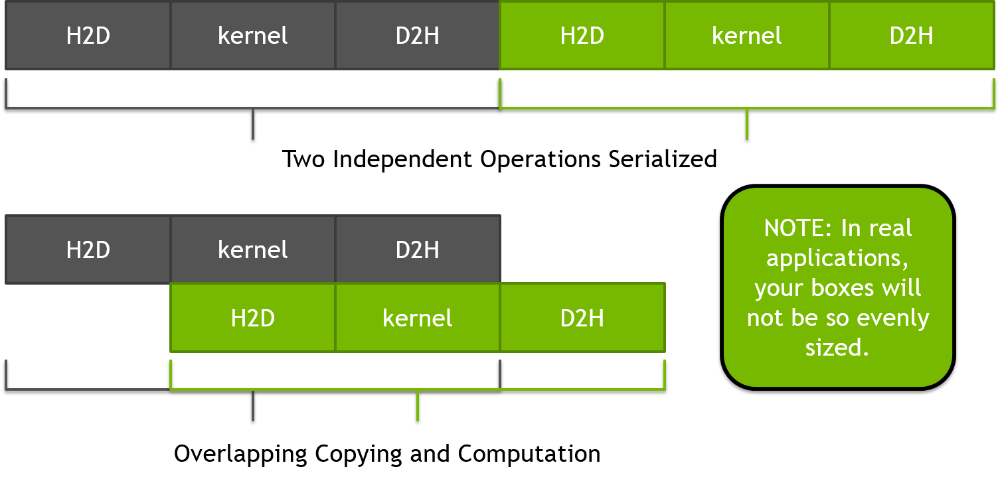
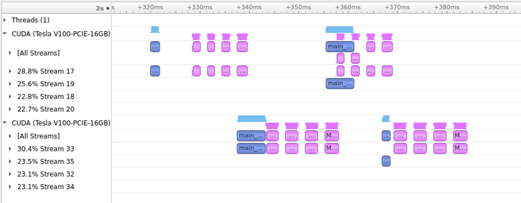

Advanced OpenACC Features
=========================
本章では、このガイドの他のセクションにうまく収まらないOpenACCの機能とテクニックについて説明します。これらのテクニックは高度なものと見なされるため、読者は本章に進む前に、前の章で説明した機能に十分慣れておく必要があります。

Asynchronous Operation
----------------------
前の章では、ホストとアクセラレータが物理的に異なるメモリを持つシステムにおいて、データ転送のコストを削減するためにデータの局所性を最適化する必要性について説明しました。正しい結果を生成するために、単に最適化できないデータ転送が常に一定量存在します。データ転送を最小化した後、ホスト、デバイス、またはその両方での他の操作とコピーをオーバーラップさせることで、それらの転送に関連するパフォーマンスペナルティをさらに削減することが可能です。これは、`async`句を使用してOpenACCで実現できます。`async`句は、`parallel`、`kernels`、および`update`ディレクティブに追加でき、関連する操作がアクセラレータまたはランタイムに実行のために送信されると、CPUはアクセラレータ操作が完了するのを待つのではなく、他のことを続けることができることを指定します。これには、追加のアクセラレータ操作をエンキューすることや、アクセラレータによって実行される作業とは無関係な他の作業を計算することが含まれる場合があります。以下のコードは、`parallel loop`とその後の`update`ディレクティブに`async`句を追加することを示しています。

~~~~ {.c .numberLines}
    #pragma acc parallel loop async
    for (int i=0; i<N; i++)
    {
      c[i] = a[i] + b[i]
    }
    #pragma acc update self(c[0:N]) async
~~~~

---

~~~~ {.fortran .numberLines}
    !$acc parallel loop async
    do i=1,N
      c(i) = a(i) + b(i)
    end do
    !$acc update self(c) async
~~~~

上記の場合、ホストスレッドは並列領域を*デフォルトの非同期キュー*にエンキューし、その後、実行はホストスレッドに戻るため、`update`もエンキューでき、最後にCPUスレッドは実行を続けます。しかし、最終的にはホストスレッドはアクセラレータで計算され、`update`を使用してホストにコピーバックされた結果を必要とするため、データを使用しようとする前に、これらの操作が完了したことを確認するためにアクセラレータと同期する必要があります。`wait`ディレクティブは、続行する前に過去の非同期操作が完了するのを待つようにランタイムに指示します。したがって、上記の例を拡張して、`update`ディレクティブによってコピーされるデータが続行する前に同期を含めることができます。

~~~~ {.c .numberLines}
    #pragma acc parallel loop async
    for (int i=0; i<N; i++)
    {
      c[i] = a[i] + b[i]
    }
    #pragma acc update self(c[0:N]) async
    #pragma acc wait
~~~~

---

~~~~ {.fortran .numberLines}
    !$acc parallel loop async
    do i=1,N
      c(i) = a(i) + b(i)
    end do
    !$acc update self(c) async
    !$acc wait
~~~~

これは便利ですが、これらの非同期操作と関連する待機に依存関係を公開して、独立した操作が潜在的に同時に実行できるようにすることがさらに便利です。`async`と`wait`の両方には、その操作のキュー番号を指定する非負の整数のオプション引数があります。同じキューに配置されたすべての操作は順番に動作しますが、異なるキューに配置された操作は互いに任意の順序で動作する可能性があります。異なるキューの操作は並列に動作する可能性がありますが、保証されているわけではありません。これらの作業キューはデバイスごとに固有であるため、2つのデバイスは同じ番号の異なるキューを持ちます。引数なしで`wait`が検出された場合、そのデバイスで以前にエンキューされたすべての作業を待機します。以下のケーススタディでは、異なる作業キューを使用して計算とデータ転送のオーバーラップを実現する方法を示します。

操作を別々のキューに配置できることに加えて、両方の結果が進む前に必要な時点でこれらのキューを一緒に結合できることが便利です。これは、`wait`に`async`句を追加することで実現できます。これは直感に反するように思えるかもしれませんので、以下のコードでこれがどのように行われるかを示します。

~~~~ {.c .numberLines}
    #pragma acc parallel loop async(1)
    for (int i=0; i<N; i++)
    {
      a[i] = i;
    }
    #pragma acc parallel loop async(2)
    for (int i=0; i<N; i++)
    {
      b[i] = 2*i;
    }
    #pragma acc wait(1) async(2)
    #pragma acc parallel loop async(2)
    for (int i=0; i<N; i++)
    {
      c[i] = a[i] + b[i]
    }
    #pragma acc update self(c[0:N]) async(2)
    #pragma acc wait
~~~~

---

~~~~ {.fortran .numberLines}
    !$acc parallel loop async(1)
    do i=1,N
      a(i) = i
    end do
    !$acc parallel loop async(2)
    do i=1,N
      b(i) = 2.0 * i
    end do
    !$acc wait(1) async(2)
    !$acc parallel loop async(2)
    do i=1,N
      c(i) = a(i) + b(i)
    end do
    !$acc update self(c) async(2)
    !$acc wait
~~~~

上記のコードは、`a`と`b`に含まれる値を別々の作業キューを使用して初期化し、潜在的に独立して実行できるようにします。`wait(1) async(2)`は、作業キュー1が完了するまで作業キュー2が続行しないことを保証します。その後、ベクトルの加算をデバイスにエンキューできます。これは、この時点までに前のカーネルが完了しているためです。最後に、コードはすべての前の操作が完了するのを待ちます。このテクニックを使用して、領域間の並行性を最大化しながらも正しい結果を与えるように、ループの依存関係を表現しました。

***ベストプラクティス:*** PCIeバスを介してホストCPUに接続されたGPUなどのオフロードアクセラレータでは、実行のためにアクセラレータに操作を送信するコストは頻繁に非常に高くなります。ルーチン内のループとデータ転送がテストされると、各並列領域と更新を非同期にし、最後のアクセラレータディレクティブの後に`wait`ディレクティブを配置することが頻繁に有益です。これにより、ランタイムはすべての作業を即座にエンキューでき、アクセラレータとホストが同期する頻度が減り、アクセラレータ上で作業を起動するコストが削減されます。この最適化を実装する場合、開発者は最後のアクセラレータディレクティブの後の`wait`を忘れないことが重要です。そうしないと、コードは誤った結果を生成する可能性があります。これは非常に有益な最適化であるため、一部のコンパイラは、すべてのアクセラレータディレクティブに対してこれを自動的に有効にするビルド時オプションを提供しています。

### Case Study: Asynchronous Pipelining of a Mandelbrot Set ###

この例では、上記に示されている画像のようなマンデルブロ集合を生成する単純なアプリケーションを変更します。画像の各ピクセルは独立して計算できるため、コードは並列化するのが簡単ですが、画像自体のサイズが大きいため、結果を画像ファイルに書き込む前にホストにコピーバックするためのデータ転送はコストがかかります。このデータ転送は発生する必要があるため、計算とオーバーラップさせることができればよいのですが、以下に示すようにコードが記述されているため、コピーが発生する前に計算全体が発生する必要があり、したがってオーバーラップするものは何もありません。*（注：`mandelbrot`関数は、各ピクセルの値を計算するために使用されるシーケンシャル関数です。スペースを節約するために本章では省略していますが、完全な例には含まれています。）*

~~~~ {.c .numberLines}
    #pragma acc parallel loop
    for(int y=0;y<HEIGHT;y++) {
      for(int x=0;x<WIDTH;x++) {
        image[y*WIDTH+x]=mandelbrot(x,y);
      }
    }
    
    #pragma acc update self(image[:WIDTH*HEIGHT])
~~~~

---

~~~~ {.fortran .numberLines}
    !$acc parallel loop
    do iy=1,width
      do ix=1,HEIGHT
        image(ix,iy) = min(max(int(mandelbrot(ix-1,iy-1)),0),MAXCOLORS)
      enddo
    enddo
    
    !$acc update self(image)
~~~~

各ピクセルは互いに独立しているため、パイプライニングとして知られる技術を使用して、画像の生成をより小さな部分に分割することが可能です。これにより、各部分の出力が次の部分が計算されている間にコピーされるようになります。以下の図は、計算とコピーが同じサイズである理想的なパイプラインを示していますが、これが実際のアプリケーションで発生することはまれです。操作を2つの部分に分割することにより、同じ量のデータが転送されますが、最初と最後の転送を除くすべての転送は計算とオーバーラップできます。これらのより小さな作業チャンクの数とサイズを調整して、最高のパフォーマンスを提供する値を見つけることができます。

マンデルブロコードは、画像生成とデータ転送をより小さく独立した部分にチャンク化することにより、同じ技術を使用できます。これは、エラーを導入する可能性を減らすために複数のステップで行われます。最初のステップは、計算にブロッキングループを導入することですが、データ転送は同じままにしておきます。これにより、作業自体が正しい結果を得るために適切に分割されていることが保証されます。各ステップの後、開発者はコードをビルドして実行し、結果の画像がまだ正しいことを確認する必要があります。

#### Step 1: Blocking Computation ####

画像生成をパイプライン化する最初のステップは、計算を独立して生成できる作業のチャンクに分割するループを導入することです。これを行うには、必要な作業ブロックの数を決定し、それを使用して各ブロックの開始境界と終了境界を決定する必要があります。次に、既存の2つのループの周りに追加のループを導入し、現在の作業ブロック内でのみ動作するように`y`ループを変更します。そのために、ループ境界を、現在のブロックの開始値と終了値として計算したもので更新します。変更されたループネストを以下に示します。

~~~~ {.c .numberLines}
    int num_blocks = 8;
    for(int block = 0; block < num_blocks; block++ ) {
      int ystart = block * (HEIGHT/num_blocks),
          yend   = ystart + (HEIGHT/num_blocks);
    #pragma acc parallel loop
      for(int y=ystart;y<yend;y++) {
        for(int x=0;x<WIDTH;x++) {
          image[y*WIDTH+x]=mandelbrot(x,y);
        }
      }
    }

    #pragma acc update self(image[:WIDTH*HEIGHT])
~~~~

---

~~~~ {.fortran .numberLines}
    num_batches=8
    batch_size=WIDTH/num_batches
    do yp=0,num_batches-1
      ystart = yp * batch_size + 1
      yend   = ystart + batch_size - 1
      !$acc parallel loop
      do iy=ystart,yend
        do ix=1,HEIGHT
          image(ix,iy) = min(max(int(mandelbrot(ix-1,iy-1)),0),MAXCOLORS)
        enddo
      enddo
    enddo

    !$acc update self(image)
~~~~

この時点で、各作業ブロックを独立して正常に生成できることを確認しただけです。このステップのパフォーマンスは、元のコードよりも著しく良くなることはなく、悪化する可能性があります。

#### Step 2: Blocking Data Transfers ####

プロセスの次のステップは、計算がすでに分割されているのと同じ方法で、デバイスとの間のデータ転送を分割することです。これを行うには、まずブロッキングループの周りにデータ領域を導入する必要があります。これにより、画像を保持するために使用されるデバイスメモリがすべての作業ブロックに対してデバイス上に残ることが保証されます。画像配列の初期値は重要ではないため、`create`データ句を使用して、デバイス上に初期化されていない配列を割り当てます。次に、`update`ディレクティブを使用して、計算後に画像の各ブロックをデバイスからホストにコピーします。これを行うには、各ブロックのサイズを決定して、現在の作業ブロックに一致する画像の部分のみを更新するようにする必要があります。このステップの終わりの結果のコードを以下に示します。

~~~~ {.c .numberLines}
    int num_blocks = 8, block_size = (HEIGHT/num_blocks)*WIDTH;
    #pragma acc data create(image[WIDTH*HEIGHT])
    for(int block = 0; block < num_blocks; block++ ) {
      int ystart = block * (HEIGHT/num_blocks),
          yend   = ystart + (HEIGHT/num_blocks);
    #pragma acc parallel loop
      for(int y=ystart;y<yend;y++) {
        for(int x=0;x<WIDTH;x++) {
          image[y*WIDTH+x]=mandelbrot(x,y);
        }
      }
    #pragma acc update self(image[block*block_size:block_size])
    }
~~~~

---

~~~~ {.fortran .numberLines}
    num_batches=8
    batch_size=WIDTH/num_batches
    call cpu_time(startt)
    !$acc data create(image)
    do yp=0,NUM_BATCHES-1
      ystart = yp * batch_size + 1
      yend   = ystart + batch_size - 1
      !$acc parallel loop
      do iy=ystart,yend
        do ix=1,HEIGHT
          image(ix,iy) = mandelbrot(ix-1,iy-1)
        enddo
      enddo
      !$acc update self(image(:,ystart:yend))
    enddo
    !$acc end data
~~~~

このステップの終わりまでに、画像の各ブロックを独立して計算およびコピーしていますが、これはまだ順次に、前のブロックの後に各ブロックが実行されています。このステップの終わりのパフォーマンスは、一般的に元のバージョンと同等です。

#### Step 3: Overlapping Computation and Transfers ####

このケーススタディの最後のステップは、デバイス操作を非同期にして、独立したコピーと計算が同時に実行されるようにすることです。これを行うには、非同期作業キューを使用して、単一ブロック内の計算とデータ転送が同じキューにあることを保証しますが、別々のブロックは異なるキューに到着するようにします。ブロック番号は、この変更に使用する便利な非同期ハンドルです。もちろん、完全に非同期に動作しているため、ホストから画像データを使用しようとする前にすべての作業が完了することを保証するために、ブロックループの後に`wait`ディレクティブを追加することが重要です。変更されたコードを以下に示します。

~~~~ {.c .numberLines}
    int num_blocks = 8, block_size = (HEIGHT/num_blocks)*WIDTH;
    #pragma acc data create(image[WIDTH*HEIGHT])
    for(int block = 0; block < num_blocks; block++ ) {
      int ystart = block * (HEIGHT/num_blocks),
          yend   = ystart + (HEIGHT/num_blocks);
    #pragma acc parallel loop async(block)
      for(int y=ystart;y<yend;y++) {
        for(int x=0;x<WIDTH;x++) {
          image[y*WIDTH+x]=mandelbrot(x,y);
        }
      }
    #pragma acc update self(image[block*block_size:block_size]) async(block)
    }
    #pragma acc wait
~~~~

---

~~~~ {.fortran .numberLines}
    num_batches=8
    batch_size=WIDTH/num_batches
    call cpu_time(startt)
    !$acc data create(image)
    do yp=0,NUM_BATCHES-1
      ystart = yp * batch_size + 1
      yend   = ystart + batch_size - 1
      !$acc parallel loop async(yp)
      do iy=ystart,yend
        do ix=1,HEIGHT
          image(ix,iy) = mandelbrot(ix-1,iy-1)
        enddo
      enddo
      !$acc update self(image(:,ystart:yend)) async(yp)
    enddo
    !$acc wait
    !$acc end data
~~~~

この変更により、あるブロックの計算部分が別のブロックのデータ転送と同時に動作することが可能になりました。開発者は、関心のあるアーキテクチャで最適な値が何であるかを判断するために、さまざまなブロックサイズを試してみる必要があります。ただし、一部のアーキテクチャでは、非同期キューを最初に使用するときに作成するコストが非常に高くなる可能性があることに注意することが重要です。長時間実行されるアプリケーションでは、キューが数時間の実行の開始時に一度作成され、全体を通して再利用される場合、このコストは償却されます。この章で使用されているデモンストレーションコードのような短時間実行コードでは、このコストがパイプライニングの利点を上回る可能性があります。これに対する2つの解決策は、タイミングセクションの前に非同期キューを事前作成する単純なブロックループをコードの先頭に導入すること、またはモジュロ演算を使用してすべてのブロック間で同じ少数のキューを再利用することです。たとえば、ブロック番号のモジュロ2を非同期ハンドルとして使用することにより、2つのキューのみが使用され、これらのキューを作成するコストは再利用によって償却されます。2つのキューは、計算と更新のオーバーラップを可能にするため、パフォーマンスの向上を確認するには一般的に十分ですが、開発者は特定のマシンで最適な値を見つけるために実験する必要があります。

以下に、NVIDIA GPUプラットフォーム上でこれらの変更をコードに適用した前後のプロファイルを示すスクリーンショットを示します。同様の結果は、任意のアクセラレートプラットフォームで可能であるはずです。16ブロックと2つの非同期キューを使用して、以下に示すように、パイプライン化しない場合のパフォーマンスに比べて、テストマシンで約2倍のパフォーマンス向上が観察されました。

Multi-device Programming
------------------------

複数のアクセラレータを含むシステムの場合、OpenACCは特定のデバイスで操作を実行するためのAPIを提供します。システムに異なるタイプのアクセラレータが含まれている場合、仕様では特定のアーキテクチャのデバイスを照会および選択することもできます。

### acc\_get\_num\_devices() ###
`acc_get_num_devices()`ルーチンを使用して、システムで使用可能な特定のアーキテクチャのデバイスの数を照会できます。`acc_device_t`型のパラメータを1つ受け取り、デバイスの整数を返します。

### acc\_get\_device\_num() and acc\_set\_device\_num() ###
`acc_get_device_num()`ルーチンは、特定のタイプの使用される現在のデバイスを照会し、そのデバイスの整数識別子を返します。`acc_set_device_num()`は、目的のデバイス番号とデバイスタイプの2つのパラメータを受け取ります。デバイス番号が設定されると、すべての操作は、後で`acc_set_device_num()`を呼び出して別のデバイスが指定されるまで、指定されたデバイスに送信されます。

### acc\_get\_device\_type() and acc\_set\_device\_type() ###
`acc_get_device_type()`ルーチンはパラメータを取らず、現在のデフォルトデバイスのデバイスタイプを返します。`acc_set_device_type()`は、ランタイムがアクセラレータ操作に使用するデバイスのタイプをランタイムに指定しますが、ランタイムがそのタイプのどのデバイスを使用するかを選択できるようにします。

OpenACCは最近、`set`ディレクティブを導入しました。これにより、OpenACC APIの使用への依存を減らしてマルチデバイスプログラミングが可能になります。`set`ディレクティブを使用して、使用するデバイス番号とデバイスタイプを設定でき、`acc_set_device_num()` API関数と機能的に同等です。デバイス番号を設定するには、`device_num`句を使用し、タイプを設定するには`device_type`句を使用します。

---

### Multi-device Programming Example ###
マルチデバイスプログラミングの例として、前に使用したマンデルブロの例をさらに拡張して、異なる作業ブロックを異なるアクセラレータに送信することができます。これを機能させるには、各デバイスでデータのデバイスコピーが作成されることを保証する必要があります。これを行うには、コード内の構造化された`data`領域を、各デバイスの非構造化`enter data`ディレクティブに置き換えます。`acc_set_device_num()`関数を使用して各`enter data`のデバイスを指定します。簡単にするために、各デバイスに完全な画像配列を割り当てますが、実際には配列の一部のみが必要です。アプリケーションのメモリ要件が大きい場合は、各アクセラレータにデータの適切な部分だけを割り当てる必要があります。

各デバイスでデータが作成されると、ブロッキングループで`acc_set_device_num()`を呼び出し、単純なモジュロ演算を使用してどのデバイスが各ブロックを受け取るかを選択すると、ブロックが異なるデバイスに送信されます。

最後に、各デバイスが完了するのを待つために、デバイス上でループを導入する必要があります。`wait`ディレクティブはデバイスごとであるため、ループは再び`acc_set_device_num()`を使用して待機するデバイスを選択し、次に`exit data`ディレクティブを使用してデバイスメモリを解放します。最終的なコードを以下に示します。

~~~~ {.c .numberLines}
    // Allocate arrays on both devices
    for (int gpu=0; gpu < 2 ; gpu ++)
    {
      acc_set_device_num(gpu,acc_device_nvidia);
    #pragma acc enter data create(image[:bytes])
    }
   
    // Distribute blocks between devices
    for(int block=0; block < numblocks; block++)
    {
      int ystart = block * blocksize;
      int yend   = ystart + blocksize;
      acc_set_device_num(block%2,acc_device_nvidia);
    #pragma acc parallel loop async(block)
      for(int y=ystart;y<yend;y++) {
        for(int x=0;x<WIDTH;x++) {
          image[y*WIDTH+x]=mandelbrot(x,y);
        }
      }
    #pragma acc update self(image[ystart*WIDTH:WIDTH*blocksize]) async(block)
    }

    // Wait on each device to complete and then deallocate arrays
    for (int gpu=0; gpu < 2 ; gpu ++)
    {
      acc_set_device_num(gpu,acc_device_nvidia);
    #pragma acc wait
    #pragma acc exit data delete(image)
    }
~~~~

---

~~~~ {.fortran .numberLines}
    batch_size=WIDTH/num_batches
    do gpu=0,1
      call acc_set_device_num(gpu,acc_device_nvidia)
      !$acc enter data create(image)
    enddo
    do yp=0,NUM_BATCHES-1
      call acc_set_device_num(mod(yp,2),acc_device_nvidia)
      ystart = yp * batch_size + 1
      yend   = ystart + batch_size - 1
      !$acc parallel loop async(yp)
      do iy=ystart,yend
        do ix=1,HEIGHT
          image(ix,iy) = mandelbrot(ix-1,iy-1)
        enddo
      enddo
      !$acc update self(image(:,ystart:yend)) async(yp)
    enddo
    do gpu=0,1
      call acc_set_device_num(gpu,acc_device_nvidia)
      !$acc wait
      !$acc exit data delete(image)
    enddo
~~~~

この例では、デバイス上に画像配列全体を配置することによりデバイスメモリを過剰に割り当てていますが、`acc_set_device_num()`ルーチンを使用して複数のデバイスを持つマシンで動作する方法の簡単な例として役立ちます。本番コードでは、開発者は、特定のデバイスが必要とする配列の部分のみがそこで利用可能になるように作業を分割したいと思うでしょう。さらに、CPUスレッドを使用することにより、デバイスへの作業をより迅速に発行し、全体的なパフォーマンスを向上させることができる可能性があります。図7.3は、2つのNVIDIA GPUに分割されたマンデルブロ計算を示すNVIDIA NSight Systemsのスクリーンショットを示しています。

